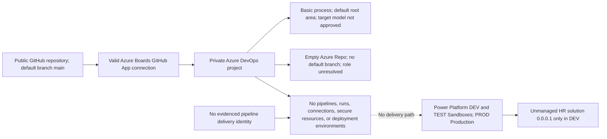
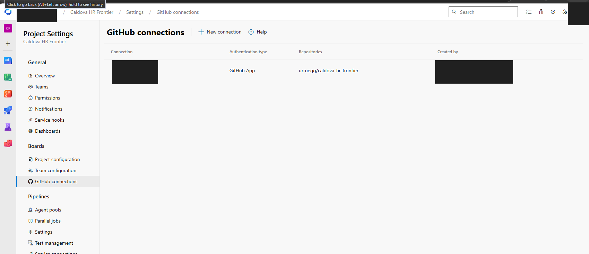
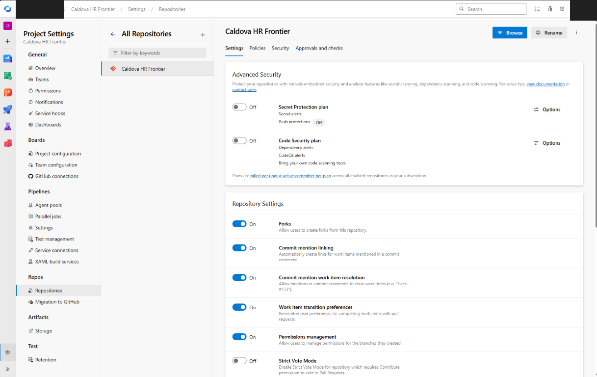
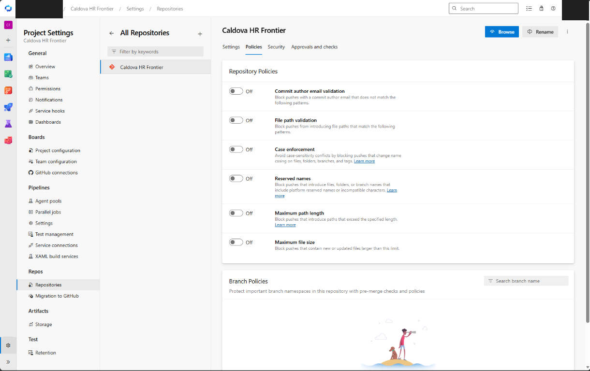
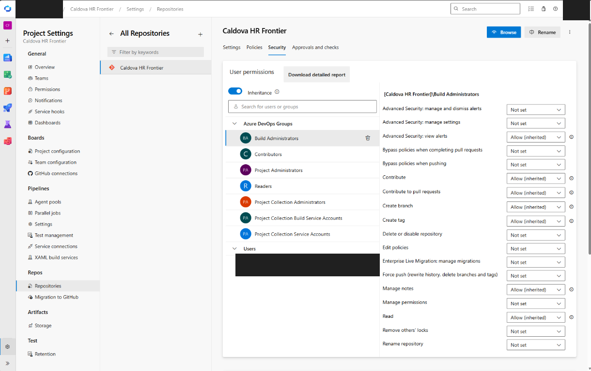
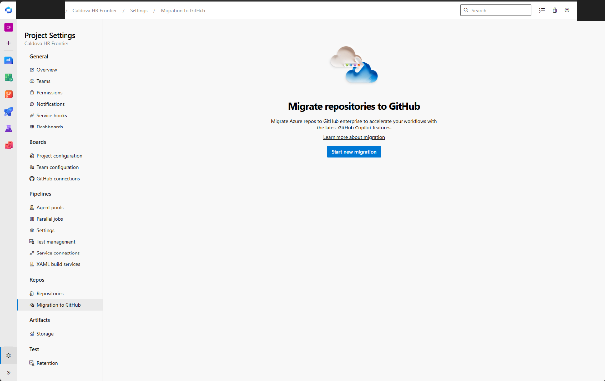
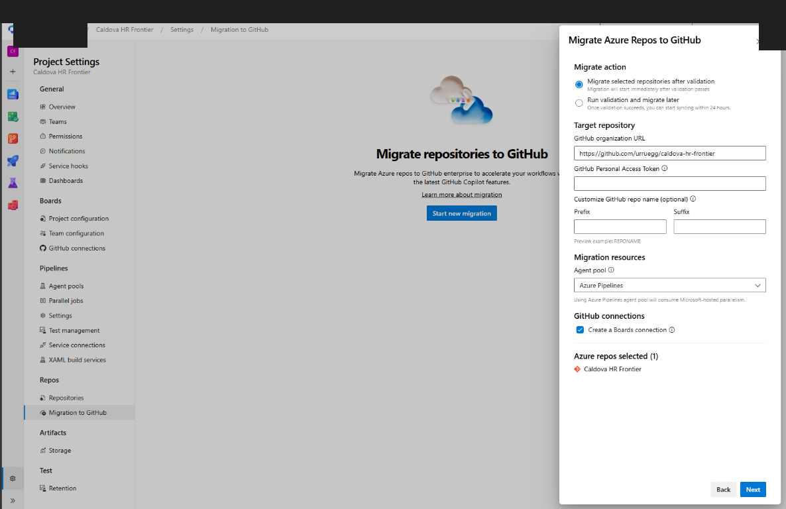

# Tenant 1 Engineering Platform Configuration Review

| Field | Value |
|---|---|
| **Version** | 1.0 |
| **Date** | 2026-09-28 |
| **Author** | docs-agent (Voice of Knowledge) |
| **Status** | Active |
| **Scope** | Tenant 1 GitHub, Azure DevOps, Azure, Entra, and Power Platform control planes |
| **References** | [Review Design](../specs/2026-09-28-tenant-1-engineering-platform-configuration-review-design.md), [Implementation Plan](../plans/2026-09-28-tenant-1-engineering-platform-configuration-review-implementation.md), [Evidence Manifest](./evidence/2026-09-28-tenant-1-engineering-platform/evidence-manifest.json), [Test Results](./evidence/2026-09-28-tenant-1-engineering-platform/test-results.json) |

## Status and Review Boundary

This is the active, point-in-time configuration review for Tenant 1. It assesses the approved review North Star: one public GitHub product-source repository connected to one private Azure DevOps project, Azure Boards as the delivery backlog, Azure Pipelines as the HR solution delivery path, and distinct Power Platform DEV, TEST, and PROD lifecycle environments.

The review was read-only. It did not create or change a repository rule, work item, pipeline, run, identity, role assignment, service connection, variable group, secure file, environment, solution, approval, or deployment. It inspected existing runtime records but did not create synthetic records. Tenant 2 and Tenant 3 were not queried; only the reproducibility implications of the Tenant 1 baseline were assessed.

Public evidence is allowlisted and sanitized. Identity-bearing raw responses remain outside Git. This report contains no private control-plane identifier or endpoint and does not reproduce raw payloads.

Power Platform scope is limited to the prerequisites needed by HR solution CI/CD: environment existence, reachability, lifecycle type, application-user queryability, and solution/publisher state. Environment access boundaries, security-group assignments, and data-policy or DLP coverage were not assessed.

## Executive Summary

Tenant 1 is **not ready for controlled HR solution delivery**. Of 50 controls, **12 PASS, 24 are confirmed GAPs, and 14 are NOT EVIDENCED**. There are no NOT APPLICABLE results.

The established foundation is useful but incomplete:

- The GitHub repository is public, `main` is the default branch, CODEOWNERS parses successfully, GitHub Actions has a constrained default permission posture, tracked actions are pinned, and a successful validation record exists on `main`.
- No active repository ruleset or classic protection applies to `main`; pull-request, review, required-check, force-push, and deletion controls are therefore not enforced.
- The private Azure DevOps project has a valid Azure Boards GitHub App installation-token connection bound to the expected GitHub repository.
- The project uses the Basic process. One default team uses the normal root area and Sprint 1 has no dates, but the target process, team model, and sprint cadence are not approved, so compatibility is not evidenced.
- The Azure Repo is empty and has no default branch. Its role remains unapproved and its project-matching name creates source-of-truth ambiguity.
- No Azure Boards work item has an external GitHub link, so connection configuration is evidenced but end-to-end Boards traceability is not.
- There are no Azure Pipelines definitions or runs, service connections, variable groups, secure files, deployment environments, or approval checks.
- No application matched the reviewed delivery-identity name and no service connection identifies a delivery principal; a pipeline delivery identity is not evidenced as configured.
- Power Platform DEV and TEST are reachable Sandbox environments and PROD is a reachable Production environment. This proves only environment existence, reachability, and lifecycle type. The HR solution is unmanaged version `0.0.0.1`, exists only in DEV, and uses the reviewed custom publisher.
- Committed tenant-specific values conflict with the intended private boundary and make clean tenant replication unsafe.
- The relevant ADRs, including [ADR-0001](../adr/0001-azure-devops-as-engineering-control-plane.md), [ADR-0002](../adr/0002-github-first-bootstrap-and-the-role-of-azure-repos.md), and [ADR-0012](../adr/0012-per-tenant-github-repository-and-account-topology.md), remain Proposed Baseline. They are recommendations, not approved operating decisions.

The immediate decision is architectural and operational, not a tooling exercise: approve the one-repository-to-one-project topology and the public/private configuration boundary before administrators build the dependent delivery controls.

## Current-State Topology

The diagram separates configuration that was directly read back from delivery capabilities that are absent or not yet proven.

| Surface | Sanitized current state | Evidence |
|---|---|---|
| GitHub source | Public repository; `main` is default; all three merge methods are allowed; merged branches are not automatically deleted. | `github-repository` |
| GitHub governance | No active repository ruleset and no classic `main` protection. CODEOWNERS is valid, but its approval is not enforced. | `github-governance` |
| GitHub validation | Repository validation exists and a successful run head SHA equals current `main`; it is not a required check. | `github-actions`, `github-run-history` |
| Azure DevOps project | Expected project is private and well formed; process is Basic. | `ado-project` |
| Azure Boards | Basic process, one default team using the root area, and Sprint 1 without dates; the target model is not approved and no external GitHub links exist on work items. | `ado-boards-config`, `ado-linkage` |
| GitHub connection | One valid installation-token connection is bound to exactly the expected GitHub repository. | `ado-github-connection`, screenshot 01 |
| Azure Repo | Empty, no default branch, and no formally approved narrow role. | `azure-repo`, screenshots 02, 03, 05, and 06 |
| Azure Pipelines | No definitions, runs, service connections, variable groups, secure files, environments, or checks. | `ado-pipelines`, `ado-pipeline-resources` |
| Entra and Azure | No application matched the reviewed delivery-identity name and no service connection identifies a principal, so pipeline federation and role scope cannot be validated. | `azure-entra` |
| Power Platform | DEV and TEST are reachable Sandboxes; PROD is reachable Production. Access boundaries and data-policy or DLP coverage were not assessed. | `power-platform-environments` |
| HR solution | Unmanaged version `0.0.0.1` with the reviewed custom publisher exists only in DEV. | `power-platform-solution` |
| Public/private boundary | Committed tenant-specific values conflict with the intended tenant-private configuration boundary. | `repository-tenant-config` |

## Evidence Coverage and Limitations

The review uses successful API or CLI read-back for configuration state, existing runtime records for behavior that had already occurred, source inspection for repository contracts, and sanitized screenshots only for portal context. Every PASS requires direct evidence; an absent transaction, unsupported API, or deliberately uncollected identity expansion remains NOT EVIDENCED.

| Area | Coverage | Limitation |
|---|---|---|
| GitHub | Repository settings, rules, branch protection, Actions permissions, workflows, run history, CODEOWNERS parse state, and available security-analysis settings. | No change was made to prove rejection behavior on protected branches because no protection exists and the review was read-only. |
| Azure DevOps project and Boards | Project, process, teams, areas, iterations, groups, GitHub connection, repository binding, Azure Repo state, and existing external links. | Detailed identity membership and effective permission expansion were intentionally not published; no existing linked work item was available. |
| Azure Pipelines | Definitions, runs, service connections, variable groups, secure files, environments, checks, and visible agent-pool metadata. | The delivery resource inventories are empty. No run exists to prove agent acquisition or parallel-job entitlement. |
| Entra and Azure | Search for the reviewed delivery application and dependent Azure configuration. | With no approved delivery application or service connection, federation and role scope have no delivery principal to evaluate. |
| Power Platform | Reachability and lifecycle type for DEV, TEST, and PROD; application-user inventory accessibility; solution, managed state, version, and publisher presence. | No delivery principal is evidenced against which application-user records and roles can be matched. Access boundaries, security-group assignments, data-policy or DLP coverage, and deployment behavior were not assessed. |
| Repository and governance | Tenant manifests, discovery evidence, ADR status, topology consistency, and repository validation. | Relevant ADRs remain Proposed Baseline, so the target model is not yet an accepted durable decision. |

Validation of the evidence package has a separate, explicit limitation:

- **248 tracked repository tests passed**, and the static repository verifier passed.
- The wider infrastructure suite recorded **523 passed, 6 failed, and 1 skipped**.
- Those six failures were attributable to a branch-relative last-five-commits test after current remote `main` was imported and to missing `pwsh.exe`. They do **not** indicate a Tenant 1 live-configuration failure.

The review therefore distinguishes repository-package validation from live-platform control evidence. A passing repository suite cannot substitute for a missing pipeline run, work-item link, approval, deployment, or identity.

## Control Results

The authoritative result set is the [Test Results](./evidence/2026-09-28-tenant-1-engineering-platform/test-results.json). Every evidence label resolves to a source or screenshot object in the [Evidence Manifest](./evidence/2026-09-28-tenant-1-engineering-platform/evidence-manifest.json), including collector, read-only operation or API class, result, and observation time. Each of the 50 controls appears exactly once below.

| ID | Domain | Outcome | Observed state | Evidence | Confidence |
|---|---|---|---|---|---:|
| GH-001 | GitHub | PASS | The repository is public, main is the default branch, and the separate Azure Repo is empty with no default branch. | `github-repository`, `azure-repo` | 10 |
| GH-002 | GitHub | GAP | GitHub Projects is enabled and merged branches are not deleted automatically; all three merge methods are allowed. | `github-repository` | 10 |
| GH-003 | GitHub | GAP | No active repository ruleset exists and classic protection for main is absent. | `github-governance` | 10 |
| GH-004 | GitHub | GAP | No active branch rule enforces pull requests, reviews, CODEOWNERS approval, stale-review dismissal, or conversation resolution. | `github-governance` | 10 |
| GH-005 | GitHub | GAP | No active ruleset or classic protection blocks force pushes or deletion of main. | `github-governance` | 10 |
| GH-006 | GitHub | GAP | The validation workflow exists and has successful main runs, but no branch rule requires its check. | `github-actions`, `github-run-history`, `github-governance` | 10 |
| GH-007 | GitHub | PASS | CODEOWNERS is present and the GitHub API reports no parsing errors. | `github-governance` | 10 |
| GH-008 | GitHub | PASS | The default workflow token permission is read; workflows cannot approve pull requests through the default token. | `github-actions` | 10 |
| GH-009 | GitHub | PASS | The action-pin manifest and tracked workflow contracts pass in the 248-test repository suite. | `repository-validation`, `github-actions` | 9 |
| GH-010 | GitHub | PASS | A completed successful validation run has a head SHA equal to current main; 19 of the last 20 recorded main runs succeeded. | `github-run-history` | 10 |
| GH-011 | GitHub | GAP | Secret scanning and push protection are enabled, but Dependabot security updates and several optional secret-analysis capabilities are disabled. | `github-security` | 10 |
| GH-012 | GitHub | PASS | Azure DevOps reports one valid installation-token connection bound to the expected GitHub repository. | `ado-github-connection`, `screenshot-01-github-connection` | 10 |
| GH-013 | GitHub | NOT EVIDENCED | One direct collaborator is visible, but no active ruleset exists and effective administrator or bypass scope was not published in the sanitized evidence. | `github-repository`, `github-governance` | 8 |
| GH-014 | GitHub | GAP | Only the Copilot environment exists and it has no protection rules; the reviewed Tenant 1 bootstrap environment is absent. | `github-environments`, `github-actions` | 10 |
| ADO-001 | Azure DevOps Boards | PASS | The expected project is present, private, and reports a well-formed state. | `ado-project` | 10 |
| ADO-002 | Azure DevOps Boards | NOT EVIDENCED | The project uses the Basic process, but the required backlog hierarchy remains Proposed Baseline and has not been approved for comparison. | `ado-project` | 10 |
| ADO-003 | Azure DevOps Boards | NOT EVIDENCED | One default team uses the normal project-root area and Sprint 1 has no dates; no approved team or sprint-cadence target exists for comparison. | `ado-boards-config` | 10 |
| ADO-004 | Azure DevOps Boards | PASS | One valid GitHub connection uses an installation token, consistent with GitHub App authentication. | `ado-github-connection` | 10 |
| ADO-005 | Azure DevOps Boards | PASS | The connection contains exactly one repository and it is the approved GitHub source repository. | `ado-github-connection` | 10 |
| ADO-006 | Azure DevOps Boards | PASS | The live connection matches the approved Tenant 1 repository and project, consistent with the platform one-connection constraint. | `ado-github-connection`, `microsoft-guidance` | 9 |
| ADO-007 | Azure DevOps Boards | NOT EVIDENCED | No work item currently has an external GitHub link, so the configured connection has no runtime traceability proof. | `ado-linkage` | 10 |
| ADO-008 | Azure DevOps Boards | GAP | The auto-created Azure Repo is empty with no default branch, but it retains the project name and has not been renamed or formally assigned the proposed configuration/template role. | `azure-repo`, `screenshot-02-azure-repo-settings`, `screenshot-05-migration-surface` | 10 |
| ADO-009 | Azure DevOps Boards | NOT EVIDENCED | Expected built-in groups and dedicated endpoint and release administrator groups exist, but unrestricted membership and effective permission expansion were intentionally not collected. | `ado-project-groups`, `screenshot-04-azure-repo-permissions` | 7 |
| PIPE-001 | Azure Pipelines | GAP | The Azure DevOps project has no pipeline definitions. | `ado-pipelines` | 10 |
| PIPE-002 | Azure Pipelines | GAP | No Azure Pipeline or separate Azure Pipelines GitHub connection exists; the working Azure Boards GitHub App does not provide pipeline repository authentication or triggers. | `ado-pipelines` | 10 |
| PIPE-003 | Azure Pipelines | GAP | No pipeline trigger configuration exists. | `ado-pipelines` | 10 |
| PIPE-004 | Azure Pipelines | GAP | No Azure Pipeline or run proves HR solution validation or build. | `ado-pipelines`, `power-platform-solution` | 10 |
| PIPE-005 | Azure Pipelines | GAP | No pipeline run or artifact exists. | `ado-pipelines` | 10 |
| PIPE-006 | Azure Pipelines | GAP | No deployment stages or releases exist; the unmanaged HR solution is present only in DEV. | `ado-pipelines`, `power-platform-solution` | 10 |
| PIPE-007 | Azure Pipelines | GAP | The Azure DevOps project has no deployment environments. | `ado-pipeline-resources` | 10 |
| PIPE-008 | Azure Pipelines | GAP | There are no environments or checks; the checks list cannot be meaningfully evaluated without a resource. | `ado-pipeline-resources`, `microsoft-guidance` | 10 |
| PIPE-009 | Azure Pipelines | GAP | The Azure DevOps project has no service connections. | `ado-pipeline-resources` | 10 |
| PIPE-010 | Azure Pipelines | NOT EVIDENCED | No service connection exists, so authentication scheme compatibility cannot be evaluated. | `ado-pipeline-resources`, `microsoft-guidance` | 10 |
| PIPE-011 | Azure Pipelines | GAP | No variable group or secure file exists, while tenant-specific identifiers and endpoints are currently committed in the public repository. | `ado-pipeline-resources`, `repository-tenant-config` | 10 |
| PIPE-012 | Azure Pipelines | NOT EVIDENCED | The Microsoft-hosted pool is visible, but no pipeline run exists and parallel-job entitlement was not available through the collected API surface. | `ado-agents` | 8 |
| PIPE-013 | Azure Pipelines | NOT EVIDENCED | Build and release groups exist, but no pipeline, service connection, environment, or resource authorization exists to evaluate effective delivery permissions. | `ado-project-groups`, `ado-pipeline-resources` | 8 |
| PIPE-014 | Azure Pipelines | GAP | No pipeline, governed template repository role, protected resource, or required-template check exists. | `ado-pipeline-resources`, `azure-repo`, `repository-topology` | 10 |
| TEN-001 | Tenant prerequisites | GAP | No application matched the reviewed delivery-identity name, and no Azure DevOps service connection identifies a delivery principal; no delivery identity is evidenced as configured for pipeline use. | `azure-entra`, `ado-pipeline-resources` | 10 |
| TEN-002 | Tenant prerequisites | NOT EVIDENCED | No delivery application or service connection exists, so no federated subject can be validated. | `azure-entra`, `ado-pipeline-resources` | 10 |
| TEN-003 | Tenant prerequisites | NOT EVIDENCED | No delivery service principal exists, so its Azure role assignments cannot be evaluated. | `azure-entra` | 10 |
| TEN-004 | Tenant prerequisites | PASS | DEV and TEST are reachable Sandbox environments and PROD is a reachable Production environment. This PASS is limited to existence, reachability, and lifecycle type; access boundaries and data-policy coverage were not assessed. | `power-platform-environments` | 10 |
| TEN-005 | Tenant prerequisites | NOT EVIDENCED | Environment application-user inventories are readable, but no approved delivery application exists to identify the required application-user record or roles. | `power-platform-application-users`, `azure-entra` | 9 |
| TEN-006 | Tenant prerequisites | PASS | DEV contains unmanaged HR solution version 0.0.0.1 with the reviewed custom publisher and prefix. | `power-platform-solution` | 10 |
| TEN-007 | Tenant prerequisites | GAP | The public repository contains tenant, subscription, project, environment, and administrator identifiers in committed manifests and evidence. | `repository-tenant-config` | 10 |
| TRACE-001 | Traceability and reproducibility | NOT EVIDENCED | No Azure Boards work item has an external GitHub link. | `ado-linkage` | 10 |
| TRACE-002 | Traceability and reproducibility | NOT EVIDENCED | No Azure Pipeline or run exists. | `ado-pipelines` | 10 |
| TRACE-003 | Traceability and reproducibility | NOT EVIDENCED | No pipeline run, artifact, Azure DevOps environment, approval, or deployment record exists. | `ado-pipelines`, `ado-pipeline-resources` | 10 |
| TRACE-004 | Traceability and reproducibility | GAP | Repository manifests, discovery scripts, workflows, and tests exist, but Boards configuration, delivery identities, service connections, pipelines, and deployment environments are not represented as completed desired state. | `repository-validation`, `repository-tenant-config`, `ado-boards-config`, `ado-pipelines` | 9 |
| TRACE-005 | Traceability and reproducibility | GAP | The repository contains multiple tenant manifests and evidence, while the per-tenant topology and removal/backport runbook remain Proposed Baseline or work in progress. | `repository-tenant-config`, `repository-topology` | 10 |
| GOV-001 | Governance | GAP | ADR-0001, ADR-0002, ADR-0012, and the Tenant 1 single-source design remain Proposed Baseline, with unresolved differences about Azure Repo purpose and tenant-private configuration. | `repository-topology` | 10 |

**Count check:** 50 total = 12 PASS + 24 GAP + 14 NOT EVIDENCED + 0 NOT APPLICABLE.

## Confirmed Gaps

This register contains all 24 GAP controls. Sequence is dependency-first by remediation wave and then by delivery priority among ready items. A lower-priority prerequisite appears before a higher-priority dependent where necessary. Priority describes delivery impact, not vulnerability severity. The observed facts and evidence labels are in the Control Results table.

| Seq. | Wave | Priority | Control | Gap and delivery impact | Dependency | Recommended owner | Corrective action | Validation test |
|---:|---:|---|---|---|---|---|---|---|
| 1 | 0 | BLOCKER | GOV-001 | Administrators cannot configure a durable target safely while the authoritative topology, private-configuration location, and Azure Repo role remain unapproved. | None | Architecture decision owner | Run an attended decision review, reconcile the ADR set, approve one target topology, and supersede conflicting text. | Verify the ADR catalogue has one approved, internally consistent decision and that runbooks, manifests, and remediation tasks reference it. |
| 2 | 1 | HIGH | GH-003 | Direct or destructive changes can bypass the intended pull-request governance path. | GOV-001 | Repository administrator | Apply an active main ruleset with the approved pull-request, review, status-check, force-push, and deletion controls. | Read back the main ruleset and verify active enforcement and exact target refs. |
| 3 | 1 | HIGH | GH-004 | Repository review policy is advisory rather than mechanically enforced. | GH-003 | Repository administrator | Configure the approved pull-request and review requirements in the active main ruleset. | Read back every pull-request rule field and verify that a direct main push is rejected in the remediation validation phase. |
| 4 | 1 | HIGH | GH-005 | History or the default branch can be rewritten or removed without a protective control. | GH-003 | Repository administrator | Add force-push and branch-deletion restrictions to the active main ruleset. | Read back the rules and execute approved negative tests against a disposable branch pattern before testing main protection. |
| 5 | 1 | HIGH | GH-006 | A change can merge without repository validation succeeding. | GH-003 | Repository administrator | Require the exact repository validation check name in the active main ruleset. | Read back required checks and prove an intentionally failing pull request cannot merge. |
| 6 | 1 | HIGH | GH-014 | Bootstrap workflows cannot rely on a reviewed environment boundary or required approval before privileged tenant operations. | GOV-001 | Repository administrator | Create the reviewed Tenant 1 bootstrap environment, restrict branches, add the approved protection rules, and keep deployment gates in Azure DevOps. | Read back the environment, branch policy, variables, protection rules, reviewer settings, and self-review behavior. |
| 7 | 1 | HIGH | TEN-007 | Tenant cloning can propagate the wrong identifiers, and the committed configuration contradicts the documented tenant-private boundary. | GOV-001, ADO-008 | Security and platform engineering | Approve an explicit public/private classification, move tenant-private values to the tenant-bound configuration repository or governed resources, and retain only safe aliases and schemas publicly. | Run a repository-wide forbidden-data scan and compare public manifests with the approved allowlist. |
| 8 | 1 | MEDIUM | GH-011 | Known vulnerable dependency updates may not be raised automatically even though weekly action updates are configured. | None | Repository administrator | Enable Dependabot security updates and record an explicit decision for optional secret-analysis capabilities. | Read back security-and-analysis state and confirm a successful Dependabot security-update configuration. |
| 9 | 1 | MEDIUM | ADO-008 | The empty repository does not duplicate source today, but its name and unresolved purpose create contributor and automation ambiguity. | GOV-001 | Azure DevOps project administrator | Approve whether to rename and repurpose the empty repository for tenant-private configuration or remove it; document the one-way content boundary. | Read back repository name, size, default branch, permissions, and documented purpose, and confirm no product source exists there. |
| 10 | 1 | MEDIUM | GH-002 | A second project surface can drift from Azure Boards, and stale merged branches add avoidable repository ambiguity. | GOV-001 | Repository owner | Disable GitHub Projects for this repository, choose the approved merge strategy, and enable merged-branch cleanup. | Read repository settings through the GitHub API and confirm Projects is disabled and merged-branch deletion matches the approved strategy. |
| 11 | 2 | BLOCKER | PIPE-001 | No Azure Pipelines delivery path exists for the HR solution. | GOV-001 | Platform engineering | Create reviewed YAML pipelines for HR solution CI and gated promotion from GitHub source. | Read back pipeline definitions and verify their repository, YAML paths, triggers, permissions, and disabled-manual-bypass controls. |
| 12 | 2 | BLOCKER | PIPE-009 | Azure Pipelines cannot authenticate to Azure or Power Platform targets. | TEN-001 | Identity and platform engineering | Create stage-specific, non-personal service connections using the safest supported authentication scheme and minimum scope. | Read endpoint type, readiness, authorization scheme, scope, project references, and pipeline authorization without retrieving secrets. |
| 13 | 2 | BLOCKER | TEN-001 | The delivery platform has no non-personal identity for Azure or Power Platform automation. | GOV-001 | Tenant identity administrator | Create and approve a dedicated delivery application and service principal with a documented lifecycle and owners. | Read back application, service principal, ownership, credentials or federation, and exact service-connection references. |
| 14 | 2 | HIGH | PIPE-003 | The HR solution has no repeatable validation trigger and future trigger behavior is undefined. | PIPE-001 | Platform engineering | Define pull-request and main CI triggers with solution and pipeline path filters. | Open an approved synthetic pull request that changes an HR solution path and verify exactly the intended CI run starts. |
| 15 | 2 | HIGH | PIPE-007 | There is no resource boundary on which to enforce deployment permissions, history, approvals, or checks. | PIPE-001 | Azure DevOps project administrator | Create reviewed TEST and PROD Azure DevOps environments with restricted pipeline authorization. | Read back environment metadata, permissions, authorized pipelines, and deployment history. |
| 16 | 2 | HIGH | PIPE-008 | A future YAML author could control deployment flow without an independently administered gate. | PIPE-007 | Release governance owner | Configure required approvals and checks on the protected environments or service connections, with PROD approvers separate from pipeline authors. | Read check configurations and execute an approved release that pauses until the expected approver acts. |
| 17 | 2 | HIGH | PIPE-002 | Future pipeline authors could accidentally use the empty Azure Repo or another source unless the GitHub source contract is explicit. | PIPE-001, ADO-008 | Platform engineering | Configure the Azure Pipelines GitHub App for only the approved repository, bind pipeline and YAML paths to it, and declare immutable source-ref behavior. | Read back the pipeline GitHub connection and repository authorization, then verify trigger delivery, GitHub Checks publication, and checked-out commit SHA. |
| 18 | 2 | HIGH | PIPE-011 | A future pipeline has no governed configuration source, and current public configuration conflicts with the documented tenant boundary. | TEN-007, ADO-008 | Platform engineering | Define the tenant-private configuration store, classify each value, and connect only reviewed non-secret and secret resources to authorized pipelines. | Scan the public repository and read Azure DevOps resource metadata to confirm the approved public/private split. |
| 19 | 2 | HIGH | PIPE-014 | Future pipeline authors could remove required deployment structure or controls in YAML without an independently administered template gate. | GOV-001, ADO-008, PIPE-001, PIPE-007 | Release governance owner | Approve the tenant-private template location, create the governed template, and attach a required-template check to a protected resource outside pipeline-author control. | Read back the required-template check and prove a pipeline that omits the governed template cannot consume the protected resource. |
| 20 | 3 | BLOCKER | PIPE-005 | TEST and PROD cannot be proven to receive the same reviewed solution artifact. | PIPE-004 | Platform engineering | Publish a versioned managed solution artifact with provenance and consume that exact artifact in deployment stages. | Compare artifact identity and hash across CI, TEST deployment, and PROD deployment records. |
| 21 | 3 | BLOCKER | PIPE-004 | The unmanaged DEV solution cannot be converted into a reviewable, reproducible release artifact. | PIPE-001, PIPE-009, TEN-001 | HR solution engineering | Implement the approved Power Platform Build Tools CI sequence and source-drift checks. | Run CI on an approved commit and verify solution validation, unpack comparison, checker results, and managed build output. |
| 22 | 4 | BLOCKER | PIPE-006 | The solution has no controlled path to TEST or PROD. | PIPE-004, PIPE-005, PIPE-007, PIPE-008, PIPE-009 | Platform engineering | Implement deployment stages that import the managed artifact into TEST and PROD with stage-specific settings. | Run an approved release and verify the same managed version in TEST and PROD with recorded import results. |
| 23 | 6 | HIGH | TRACE-005 | A repository clone can retain another tenant owner, identifiers, endpoints, or discovery evidence and can connect to only one Azure Boards organization. | GOV-001, TEN-007 | Cross-tenant platform owner | Approve the per-tenant topology, finish the seed-and-sanitize runbook, and add an automated tenant-isolation conformance test. | Create a disposable clone from the runbook and prove it contains exactly one tenant manifest, no foreign identifiers, and one intended Boards connection target. |
| 24 | 6 | MEDIUM | TRACE-004 | Tenant 1 cannot yet be rebuilt end to end from the repository, and manual configuration can drift. | GOV-001, ADO-002, ADO-003, PIPE-001, TEN-001 | Engineering platform owner | Extend the desired-state and conformance model to Boards, pipelines, identities, connections, environments, and post-deployment evidence. | Rebuild or dry-run the Tenant 1 control plane from reviewed parameters and compare every supported read-back with desired state. |

## Not-Evidenced Controls

These 14 controls are not failures disguised as passes. Each requires an approved target, missing permission expansion, newly configured dependent resource, or approved runtime transaction before an outcome can be established.

| Control | Missing evidence | Dependency before validation | Required validation |
|---|---|---|---|
| GH-013 | One direct collaborator is visible, but no active ruleset exists and effective administrator or bypass scope was not published in the sanitized evidence. | GH-003 | Export the sanitized administrator boundary, configure only approved pull-request bypass actors, and read back every ruleset bypass actor and mode. |
| ADO-002 | The project uses the Basic process, but the required backlog hierarchy remains Proposed Baseline and has not been approved for comparison. | GOV-001 | Read back process metadata and create a synthetic work-item hierarchy in the remediation validation phase. |
| ADO-003 | One default team uses the normal project-root area and Sprint 1 has no dates; no approved team or sprint-cadence target exists for comparison. | ADO-002 | Read back teams, team fields, areas, iterations, dates, and default backlog settings. |
| ADO-007 | No work item currently has an external GitHub link, so the configured connection has no runtime traceability proof. | ADO-002, ADO-003 | Create an approved synthetic work item, reference it from a branch, commit, and pull request, merge to main, and verify links and the intended state transition. |
| ADO-009 | Expected built-in groups and dedicated endpoint and release administrator groups exist, but unrestricted membership and effective permission expansion were intentionally not collected. | None | Export the Azure DevOps detailed permission report, sanitize identities, and verify effective permissions and group memberships against an approved role matrix. |
| PIPE-010 | No service connection exists, so authentication scheme compatibility cannot be evaluated. | PIPE-009, TEN-001 | Read back each connection scheme and compare it with current Microsoft support for the exact Azure and Power Platform task types. |
| PIPE-012 | The Microsoft-hosted pool is visible, but no pipeline run exists and parallel-job entitlement was not available through the collected API surface. | PIPE-001 | Queue an approved validation run after pipeline creation and confirm it acquires an agent without a parallelism error. |
| PIPE-013 | Build and release groups exist, but no pipeline, service connection, environment, or resource authorization exists to evaluate effective delivery permissions. | PIPE-001, PIPE-007, PIPE-009 | Export sanitized effective permissions for build identities and protected resources after they exist, and compare them with the approved role matrix. |
| TEN-002 | No delivery application or service connection exists, so no federated subject can be validated. | TEN-001, PIPE-009 | Compare each federated credential issuer, subject, and audience with the exact service connection read-back. |
| TEN-003 | No delivery service principal exists, so its Azure role assignments cannot be evaluated. | TEN-001 | List role assignments for the delivery principal and reject standing Owner, User Access Administrator, or unsupported broad Contributor scope. |
| TEN-005 | Environment application-user inventories are readable, but no approved delivery application exists to identify the required application-user record or roles. | TEN-001 | Query each environment for the exact delivery application ID and verify enabled state, business unit, and least-privilege security roles. |
| TRACE-001 | No Azure Boards work item has an external GitHub link. | ADO-007 | Execute the approved AB# synthetic transaction defined for ADO-007. |
| TRACE-002 | No Azure Pipeline or run exists. | PIPE-001, ADO-007 | Run CI for a commit linked to an approved work item and verify source and Integrated in build links. |
| TRACE-003 | No pipeline run, artifact, Azure DevOps environment, approval, or deployment record exists. | PIPE-005, PIPE-006, PIPE-007, PIPE-008 | Execute an approved end-to-end release and correlate commit, work item, artifact hash, approvals, imports, and final solution version. |

## Dependency-Ordered Remediation Waves

All seven waves remain required. A wave may begin only when its predecessor has produced the decision or control on which it depends.

| Wave | Objective | Included control work | Exit condition |
|---:|---|---|---|
| 0 | Approve the target operating model and reconcile ADR-0001/ADR-0002. | GOV-001, including alignment with ADR-0012. | One approved topology defines source authority, Azure Repo purpose, private configuration, and per-tenant ownership. |
| 1 | Remove source-of-truth ambiguity, approve the Boards model, and prove isolated Boards linkage. | GH-002 through GH-006, GH-011, GH-014, ADO-002, ADO-003, ADO-007, ADO-008, TEN-007, TRACE-001. | GitHub and Boards desired state is approved and enforced, the Azure Repo/private boundary is explicit, and one isolated AB# linkage/state-transition transaction passes. |
| 2 | Establish pipeline identities, GitHub trust, service connections, templates, and environment boundaries. | TEN-001 through TEN-005, PIPE-001 through PIPE-003, PIPE-007 through PIPE-014. | A non-personal identity, separate Azure Pipelines GitHub App, supported authentication, governed template, least-privilege connections, protected resources, secure configuration, and executable pipeline foundation exist. |
| 3 | Implement HR solution CI and immutable artifact production. | PIPE-004, PIPE-005. | An approved commit produces one validated, versioned managed artifact with provenance. |
| 4 | Export/build from unmanaged DEV and implement gated TEST and PROD promotion. | PIPE-006, PIPE-007, PIPE-008, with the Wave 2 identity and connections. | One managed artifact is built from the unmanaged DEV source and promoted unchanged to TEST and PROD with independent approvals and retained deployment records. |
| 5 | Execute full cross-system traceability and deployment proof. | PIPE-012, TRACE-002, TRACE-003, reusing the Wave 1 Boards linkage contract. | One approved transaction correlates work item, source, run, artifact, approvals, deployment, and final solution version. |
| 6 | Extract reusable Tenant 2/3 conformance automation and runbooks. | TRACE-004, TRACE-005 and repeatable permission/read-back checks. | A disposable tenant clone passes isolation and desired-state conformance without Tenant 1 values. |

## Post-Remediation Validation Tests

The validation phase is intentionally active and must receive a separate approval because it creates synthetic records and attempts controlled negative cases.

| Test pack | Required tests | Pass criterion |
|---|---|---|
| Decision consistency | Re-read ADR status, catalogue references, runbooks, manifests, and target topology. | One approved decision is internally consistent and all implementation artifacts point to it. |
| Repository governance | Read the active ruleset; attempt approved direct-push, force-push, deletion, missing-review, unresolved-conversation, and failing-check cases. | Read-back matches the policy and every disallowed case is rejected. |
| Boards and source authority | Read process, teams, areas, iterations, Azure Repo purpose, and GitHub settings; execute one approved work-item linkage transaction. | Structure matches desired state, no competing product source exists, and branch, commit, pull request, and merge links are recorded. |
| Identity and protected resources | Read the approved delivery application, federation or supported alternative, role scope, service connections, application users, environments, approvals, and effective permissions. | Every resource is non-personal, minimum-scope, stage-specific, explicitly authorized, and mapped to the approved role matrix. |
| CI and artifact | Trigger an approved HR solution change and inspect validation, source-drift, checker, build, provenance, and artifact records. | Exactly the intended CI runs and produces one immutable managed artifact tied to the reviewed commit. |
| Promotion and traceability | Promote the same artifact through TEST and PROD, requiring independent approval; correlate all records. | Work item, commit, run, artifact hash, approval, import, and final solution version form one complete chain. |
| Tenant reproducibility | Run the seed-and-sanitize procedure against a disposable Tenant 2 or Tenant 3 clone and execute conformance read-back. | The clone has one tenant manifest, one intended Boards target, no Tenant 1 values, and no inherited Tenant 1 privilege. |

## Tenant 2 and Tenant 3 Reproducibility

Tenant 1 is not yet a safe template for Tenant 2 or Tenant 3. This is an assessment of reproducibility, not evidence that either future tenant has been configured.

Each future tenant needs:

1. its own GitHub repository and Azure DevOps project;
2. its own approved delivery identity, service connections, protected environments, and role assignments;
3. tenant-private values generated or supplied at bootstrap rather than copied from Git;
4. exactly one intended Azure Boards GitHub App connection target;
5. an idempotent desired-state runbook followed by sanitized read-back;
6. an isolation test that rejects foreign tenant values, evidence, owners, endpoints, or privileges.

The current repository fails that standard because tenant-specific values are committed, multiple tenant manifests and evidence coexist, and the topology and seed-and-sanitize procedure remain unapproved or incomplete. Tenant 2 and Tenant 3 work should not begin by cloning values from Tenant 1. It should begin after Waves 0 and 1 establish the boundary, and it should be accepted only after Wave 6 proves a disposable clone.

## Sanitized Screenshot Evidence

The screenshots provide portal context; API and CLI read-back remain authoritative for control state. Opaque redaction removes tenant-bearing navigation, identity, avatar, and browser-location details.

*Screenshot 01 - Azure Boards shows the GitHub App connection scoped to the expected repository. API read-back proves valid installation-token authentication and binding for GH-012, ADO-004, and ADO-005.*

*Screenshot 02 - The separate Azure Repo settings surface exists. API read-back, not the image alone, proves the repository is empty and has no default branch for ADO-008.*

*Screenshot 03 - No Azure Repo branch policy is visible. This supports the finding that the empty Azure Repo has no approved delivery role; GitHub `main` governance is assessed independently through GitHub read-back for ADO-008.*

*Screenshot 04 - Azure Repo permissions are inherited. It supports the need for a sanitized detailed effective-permission export before ADO-009 can be evidenced.*

*Screenshot 05 - The migration surface concerns moving Azure Repos content to GitHub. It is not the required GitHub-first Boards or Pipelines integration path and supports ADO-008 and PIPE-002.*

*Screenshot 06 - The migration dialog would move Azure Repos content to GitHub; it does not configure an already GitHub-first repository for Boards or Pipelines and supports ADO-008 and PIPE-002.*

## Microsoft Guidance

The control baseline uses only the following Microsoft Learn sources recorded by the evidence collection. They define the supported connection, approval, protected-resource, identity, application-user, and Power Platform pipeline expectations used in this review.

1. [Azure Boards and GitHub integration](https://learn.microsoft.com/azure/devops/boards/github/?view=azure-devops)
2. [Install the Azure Boards GitHub App](https://learn.microsoft.com/azure/devops/boards/github/install-github-app?view=azure-devops)
3. [Get GitHub connections](https://learn.microsoft.com/en-us/rest/api/azure/devops/wit/github-connections/get-github-connections?view=azure-devops-rest-7.2)
4. [Approvals and checks](https://learn.microsoft.com/azure/devops/pipelines/process/approvals?view=azure-devops)
5. [List approval and check configurations](https://learn.microsoft.com/en-us/rest/api/azure/devops/approvalsandchecks/check-configurations/list?view=azure-devops-rest-7.1)
6. [List Azure Pipelines environments](https://learn.microsoft.com/en-us/rest/api/azure/devops/distributedtask/environments/list?view=azure-devops-rest-7.1)
7. [Get service endpoints](https://learn.microsoft.com/en-us/rest/api/azure/devops/serviceendpoint/endpoints/get-service-endpoints?view=azure-devops-rest-7.1)
8. [Configure workload identity](https://learn.microsoft.com/azure/devops/pipelines/release/configure-workload-identity?view=azure-devops)
9. [Azure DevOps authentication guidance](https://learn.microsoft.com/azure/devops/integrate/get-started/authentication/authentication-guidance?view=azure-devops)
10. [Manage Power Platform application users](https://learn.microsoft.com/power-platform/admin/manage-application-users)
11. [Power Platform Build Tools for Azure DevOps](https://learn.microsoft.com/power-platform/alm/devops-build-tools)
12. [Build GitHub repositories with Azure Pipelines](https://learn.microsoft.com/azure/devops/pipelines/repos/github?view=azure-devops)
13. [Define Azure Boards area paths and assign them to teams](https://learn.microsoft.com/azure/devops/organizations/settings/set-area-paths?view=azure-devops)
14. [Power Platform solution concepts](https://learn.microsoft.com/power-platform/alm/solution-concepts-alm)
15. [Power Platform data policies](https://learn.microsoft.com/power-platform/admin/wp-data-loss-prevention)

Guidance does not prove configuration. It supplies the comparison baseline; the outcomes come from the sanitized Tenant 1 read-back and existing runtime records.

## Conclusion

Tenant 1 has a credible starting connection between the expected public GitHub repository and private Azure DevOps project, a valid repository validation history, reachable DEV, TEST, and PROD Power Platform environments, and the expected unmanaged HR solution prerequisite in DEV. Those are configured and evidenced.

Tenant 1 does not have enforced `main` governance, an approved Boards operating model, an approved private configuration boundary, an evidenced pipeline delivery identity, Azure Pipelines resources, HR solution CI, immutable artifact production, or gated promotion. Confirmed absences are configuration gaps; process compatibility and identity details that cannot be proven remain explicitly not evidenced.

Boards linkage, effective permissions, authentication compatibility, agent and parallel readiness, federation, role scope, application-user assignment, source-to-build correlation, and end-to-end deployment traceability are not evidenced because their required resources or runtime transactions do not yet exist or were intentionally not expanded into public evidence.

The correct next action is Wave 0 decision approval, followed by dependency-ordered remediation and separately approved active validation. Until the final synthetic transaction and tenant-isolation test pass, Tenant 1 is neither deployment-ready nor a proven source for Tenant 2 and Tenant 3.
