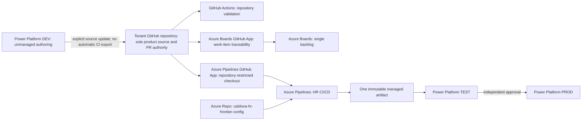
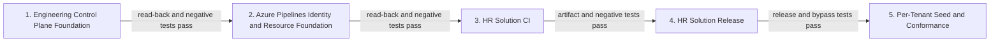

# Tenant 1 Engineering Platform Remediation Design

| Field | Value |
|---|---|
| **Version** | 1.2 |
| **Date** | 2026-09-28 |
| **Author** | docs-agent (Voice of Knowledge) |
| **Status** | Superseded |
| **Scope** | Tenant 1 engineering platform and HR solution delivery control plane |
| **References** | [Approved Lean Engineering Platform Design](2026-09-28-tenant-1-lean-engineering-platform-design.md), [Active Tenant 1 Configuration Review](../reviews/2026-09-28-tenant-1-engineering-platform-configuration-review.md), [ADR-0001](../adr/0001-azure-devops-as-engineering-control-plane.md), [ADR-0002](../adr/0002-github-first-bootstrap-and-the-role-of-azure-repos.md), [ADR-0012](../adr/0012-per-tenant-github-repository-and-account-topology.md), [Tenant 1 Engineering Platform Configuration Review Design](2026-09-28-tenant-1-engineering-platform-configuration-review-design.md) |

> **Superseded:** The [Tenant 1 Lean Engineering Platform Design](2026-09-28-tenant-1-lean-engineering-platform-design.md) replaced this design on 2026-09-28. Do not use this document to authorize or plan implementation. Its original content is retained below as historical decision context; the active read-only configuration review remains valid evidence.

## Status and Authority

This design was approved through attended design review on 2026-09-28 and was later superseded the same day by the approved lean design linked above.
All present-tense approvals and requirements below describe the superseded target and have no current implementation authority.

This specification approves the remediation design and its sequencing. It does not itself authorize an unplanned live mutation, approve a plan whose hash has changed, or prove that any target control is already configured.

ADR-0001, ADR-0002, and ADR-0012 remain **Proposed Baseline** at the time of publication. Wave 0 must update their decision text, metadata statuses, catalogue entries, and cross-references through attended review before anyone describes those ADRs as approved or accepted. Approval of this specification approves the remediation direction; it does not silently perform or pre-approve those ADR mutations.

Version 1.1 records the attended transition decision for existing Tenant 2 data: Slice 1 migrates and removes Tenant 1 private values, but preserves the existing Tenant 2 manifest and discovery evidence until Slice 5 hands them to Tenant 2's own repository. Slice 1 may add only the neutral public-key metadata needed to keep existing explicit-path tooling valid, then pins both files by hash. This temporary exception does not weaken the final one-repository-per-tenant target.

## Objective

Remediate the gaps in the active Tenant 1 configuration review without creating a second product source, weakening tenant isolation, or combining bootstrap, non-production delivery, and production authority. The program must establish the engineering control plane first, then add delivery identities and protected resources, CI, release, and reusable per-tenant conformance in that order.

The current sprint contains only the **Engineering Control Plane Foundation** slice. It creates no Azure Pipeline and performs no Power Platform deployment.

## Approved Target Topology

Each tenant has one independent GitHub repository and one Azure DevOps project. Tenant boundaries are not implemented as branches, folders, manifests in a shared repository, or a connection that is repointed between projects.



### System Responsibilities

| Surface | Approved responsibility | Explicit boundary |
|---|---|---|
| Tenant GitHub repository | Sole product-source location and pull-request authority. | Product source is not copied to Azure Repos. |
| GitHub Actions | Repository validation, including governance and traceability checks. | It does not own HR solution CI/CD or deployment. |
| Azure Boards | Single backlog for durable delivery work. | GitHub Projects is disabled; no second planning board is maintained. |
| Azure Pipelines | HR solution CI, immutable artifact publication, and controlled TEST-to-PROD delivery. | It consumes GitHub source; it does not establish a competing source authority. |
| Azure Repo `caldova-hr-frontier-config` | Tenant-private configuration, governed pipeline templates, operational runbooks, configuration schemas, and sanitized evidence. | It contains no product source, credentials, unrestricted membership exports, bidirectional synchronization, or initial disaster-recovery mirror. |
| Power Platform DEV | Unmanaged maker and authoring environment. | Uncommitted DEV state is not a release source, and CI does not export DEV automatically. |
| Power Platform TEST | First import target for the managed artifact and its release checks. | TEST cannot rebuild or replace the artifact. |
| Power Platform PROD | Final import target after independent approval. | PROD receives the artifact already verified in TEST; unmanaged hotfixes are prohibited. |

The private Azure Repo is not a secret store. Secrets remain outside Git and use federation or an approved protected Azure DevOps resource only where federation is unsupported. Sanitized evidence must still exclude secrets and unrestricted identity or membership listings even though the repository is private.

### Azure Boards Operating Model

Tenant 1 uses the built-in **Agile** process. It starts with one default team using the project root area. A second team and subordinate team area are created only when a real second team exists; they are not created speculatively.

Iterations are contiguous 14-day periods. An attended operator supplies the first iteration start date; automation must not infer it from the current date, repository history, or an incomplete Sprint 1 record. The current sprint creates six iterations from that input and reads back every start and finish date.

The durable backlog hierarchy is:

```text
Epic
└─ Feature
   └─ User Story
```

The current remediation work is represented by durable work items in this hierarchy, not by synthetic records that are deleted after testing.

### Source and Power Platform ALM

DEV is the unmanaged authoring environment, but GitHub remains the sole releasable product source. A DEV change becomes releasable only after an explicit source update exports and unpacks it, reviews it through a GitHub pull request, and merges it into the authoritative branch. CI starts from that committed unpacked source and never performs an automatic DEV export.

For each release, HR Solution CI validates the reviewed GitHub source and packs the managed solution exactly once. It records provenance and a checksum, then publishes one immutable managed artifact. HR Solution Release imports that unchanged artifact into TEST, verifies the import, and imports the same artifact into PROD only after an independent approval. No stage rebuilds the solution, substitutes another artifact, or applies an unmanaged hotfix.

### Identity and GitHub App Separation

| Boundary | Identity or connection | Permitted use |
|---|---|---|
| Bootstrap | Dedicated bootstrap identity | Creates or reconciles the approved control-plane foundation under attended execution. It is not a routine delivery identity. |
| Non-production delivery | Dedicated non-production delivery identity | Performs only the approved CI and TEST operations at minimum scope. It has no PROD import authority. |
| Production delivery | Dedicated production delivery identity | Performs only the approved PROD release operation after the independent gate. It has no bootstrap authority. |
| Backlog integration | Azure Boards GitHub App | Links GitHub branches, commits, and pull requests to Azure Boards and applies the intended merge transition. |
| Pipeline integration | Separate Azure Pipelines GitHub App | Reads only the approved tenant GitHub repository for pipeline triggers, checkout, and checks. |

The two GitHub Apps are separate installations for separate purposes. A working Azure Boards GitHub App connection is not pipeline authentication, and the Azure Pipelines GitHub App is not a backlog connection.

## Program Slices and Sequence

The remediation is decomposed into five independently specified and accepted slices:

| Slice | Specification boundary | Exit gate |
|---:|---|---|
| 1 | **Engineering Control Plane Foundation.** Reconciles the decisions, establishes the private configuration boundary, activates bootstrap trust, enforces GitHub governance, configures Azure Boards, and proves one real `Fixes AB#` transaction. This is the only live slice in the current sprint. | All Wave 0 and current-sprint acceptance checks pass, including read-back and negative tests. |
| 2 | **Azure Pipelines Identity and Resource Foundation.** Establishes delivery identities, the repository-restricted Azure Pipelines GitHub App, the configuration repository resource, service connections, protected resources, environments, approvals, checks, and explicit authorizations. | Authentication compatibility, least privilege, resource checks, read-back, and negative authorization tests pass. |
| 3 | **HR Solution CI.** Validates GitHub unpacked source and produces one immutable managed artifact with provenance and checksum. | CI and artifact-integrity tests pass for an approved commit. |
| 4 | **HR Solution Release.** Imports the unchanged artifact into TEST and then PROD after an independent approval. | TEST verification, PROD approval, unchanged-hash proof, release read-back, and negative bypass tests pass. |
| 5 | **Per-Tenant Seed and Conformance.** Produces a detached tenant seed, attended private configuration, and tenant-isolation and desired-state conformance. | A disposable seed contains no foreign tenant state and passes the complete conformance pack. |



A later slice does not start until the preceding slice's complete read-back and applicable negative tests pass. A failed or incomplete gate stops the program; it is not converted into deferred evidence.

## Slice 1: Engineering Control Plane Foundation

### Wave 0 Decision Gate

Before the first live platform mutation:

1. Reconcile ADR-0001, ADR-0002, and ADR-0012 with this approved topology.
2. Update each ADR's own status only through the attended decision-record change.
3. Update the ADR catalogue and affected references.
4. Read the merged files back and confirm there is one consistent source, backlog, private-repository, and per-tenant topology.

Until that gate completes, the target in this specification is approved for remediation planning, but the three ADR artifacts must still be described by their actual **Proposed Baseline** statuses.

### Current-Sprint Acceptance

All checkpoints are mandatory and run in order. A checkpoint is complete only when its postconditions are read back and its applicable negative tests pass.

| Checkpoint | Approved work | Acceptance |
|---|---|---|
| **A — Pre-state and rollback evidence** | Resolve the exact authenticated contexts and stable resource IDs; collect the allowlisted pre-state; hash it; identify rollback or forward-recovery operations and their limits; and produce the immutable mutation plan. | The reviewed context, IDs, pre-state hash, plan hash, rollback evidence, and recovery owner exist before mutation. Evidence contains no secret or unrestricted membership list. Any resource without a safe, approved recovery path remains unchanged. |
| **B — Private configuration boundary and overlay migration** | Rename the empty Azure Repo to `caldova-hr-frontier-config`; establish its allowlisted content boundary; move Tenant 1 private overlays out of the public GitHub repository; and retain safe public source plus the explicitly allowlisted Tenant 2 transition files. | API read-back confirms the exact repository name and boundary. A public-repository scan finds no Tenant 1 private overlay and no tenant-private file except the exact Tenant 2 manifest and discovery evidence recorded by reviewed hash. The only permitted Tenant 2 file change is neutral public-key metadata required by the explicit-path contract. The Azure Repo contains only Tenant 1 private configuration, governed templates, runbooks, schemas, and sanitized evidence; it contains no Tenant 2 data, product source, credential, bidirectional sync, or disaster-recovery mirror. |
| **C — Bootstrap trust** | Use the existing `Initialize-TenantTrust` `WhatIf` and read-back pattern for the dedicated bootstrap trust. Create the exact `bootstrap-<tenant>` GitHub Environment, restrict it to `main`, require the approved reviewer, prevent self-review, and store only reviewed non-secret identifiers as Environment variables. Review the zero-mutation plan, approve its exact hash, perform each approved mutation under the fail-closed contract, and re-run read-back. | The approved plan hash equals the executed plan hash. The application, service principal, federated credential, Azure DevOps entitlement, GitHub Environment, branch restriction, reviewer, self-review setting, and non-secret variables all read back with the planned stable IDs and complete postconditions; every item is then reported as existing on the final zero-mutation run. A step without supported complete read-back is not executed. |
| **D — GitHub governance** | Run `Enable-GitHubGovernance` to apply the approved repository settings and active `main` ruleset. | Read-back proves squash-only normal merge, merged-branch deletion, GitHub Projects disabled, Dependabot security updates enabled, and an active `main` ruleset requiring a pull request, one approval, stale-review dismissal, CODEOWNERS review, resolved conversations, repository validation, the `AB#` traceability check, force-push blocking, deletion blocking, and repository-owner bypass in pull-request-only mode. Applicable merge and governance negative tests are rejected. |
| **E — Azure Boards foundation** | Inventory existing work items and configuration; perform the attended Basic-to-Agile process conversion; retain one default team on the root area; create six contiguous 14-day iterations from the attended first-start input; and create the durable Epic, Feature, and User Stories for the approved work. | Pre-existing work is accounted for without silent deletion. Read-back proves the built-in Agile process, one default team, the root area, all six iteration dates, and the reviewed durable hierarchy and assignments. No second team or speculative area exists. |
| **F — Real Wave 1 pull request** | Use a real current-sprint User Story and a real change in the authoritative GitHub repository. Put `Fixes AB#<work-item-id>` in the pull request, satisfy the active ruleset, and merge normally by squash. | Azure Boards and GitHub read-back show the intended branch, commit, pull-request, and merge linkage to the durable work item; the predeclared work-item transition occurred; all required checks and review passed; and the merged branch was deleted. This is not a disposable synthetic transaction. |

The current sprint is accepted only when Wave 0 and checkpoints A through F all pass and the evidence proves that no Azure Pipeline, managed artifact, Power Platform import, or deployment was created. This acceptance is explicitly transitional: the full public/private-boundary and single-tenant controls remain open while the hash-pinned Tenant 2 files remain in this repository.

## Slice 2: Azure Pipelines Identity and Resource Foundation

This slice begins with an authentication compatibility spike against the exact current Power Platform task, Azure DevOps service-connection, and tenant capabilities. Workload identity is required wherever the selected task and endpoint support it. A credential-bearing protected resource is permitted only where federation is unsupported, and that exception requires an owner, minimum scope, expiry or rotation contract, explicit pipeline authorization, and sanitized read-back.

The slice establishes:

1. separate bootstrap, non-production delivery, and production delivery identities;
2. an Azure Pipelines GitHub App installation restricted to the one approved GitHub repository;
3. `caldova-hr-frontier-config` as an explicitly authorized repository resource;
4. stage-specific service connections so non-production authority cannot reach PROD;
5. non-secret variable groups only;
6. secure resources only for the approved federation-unsupported exception;
7. separate Azure DevOps TEST and PROD environments;
8. TEST checks and an independently administered PROD approval;
9. a required-template check backed by the governed template in the private Azure Repo; and
10. explicit per-pipeline authorization for every repository, service connection, variable group, secure resource, and environment.

Open access to protected resources is prohibited. Pipeline entry-point YAML may remain with the authoritative GitHub source, but it must consume the governed template and cannot remove independently administered checks.

## Slice 3: HR Solution CI

HR Solution CI consumes the reviewed GitHub commit and its unpacked Power Platform solution source. It:

1. validates repository and solution structure;
2. runs the approved automated tests;
3. runs Power Platform solution validation and Solution Checker;
4. packs the managed solution exactly once;
5. records source commit, tool and template versions, solution version, and build identity as provenance;
6. computes and records the artifact checksum; and
7. publishes the managed package as an immutable pipeline artifact.

CI does not export from DEV automatically, modify DEV, import a solution, or rebuild an artifact for a later stage. If source validation, tests, Solution Checker, provenance, publication, or checksum verification is incomplete, no releasable artifact exists.

## Slice 4: HR Solution Release

HR Solution Release consumes the immutable artifact published by Slice 3. It does not check out source to rebuild the package.

The release sequence is:

1. verify artifact identity, provenance, and checksum;
2. import the managed artifact into TEST with the non-production identity and TEST settings;
3. verify the TEST import, managed state, version, and required post-import checks;
4. pause for approval by the independent PROD release owner;
5. re-verify the same artifact checksum;
6. import that artifact into PROD with the production identity and PROD settings; and
7. verify the PROD import, managed state, version, approval record, and complete traceability chain.

A TEST failure, hash mismatch, missing check, authorization mismatch, or rejected or absent approval stops the release. Rebuilding for PROD, substituting an artifact, bypassing the environment gate, and applying an unmanaged hotfix are prohibited.

## Slice 5: Per-Tenant Seed and Conformance

A new tenant starts from a one-time detached copy, not a live fork and not an automatically synchronized shared repository. Before that copy is used:

1. remove every foreign tenant manifest, overlay, endpoint, owner, identifier, discovery record, evidence record, connection target, and privilege reference;
2. establish the new tenant's independent GitHub repository and Azure DevOps project;
3. supply tenant-private configuration through an attended process into that tenant's private `caldova-hr-frontier-config` repository and protected resources;
4. run public/private boundary, identity, repository, Boards, pipeline-resource, and Power Platform conformance;
5. run tenant-isolation negative tests that deliberately search for foreign state; and
6. retain only sanitized conformance evidence.

Changes shared after seeding are deliberate pull requests to each affected tenant repository. There is no automatic backport, upstream merge, bidirectional synchronization, or shared branch. If repeated deliberate backports become unsustainable, that is a future shared-component design decision, not permission to add synchronization here.

For Tenant 2, Slice 5 begins by proving that the exact hash-pinned transition manifest and discovery evidence still match the files preserved during Slice 1. The handoff copies them to Tenant 2's private boundary and removes them from Tenant 1 only after destination read-back succeeds. Until then, no script or workflow may treat the retained Tenant 2 files as Tenant 1 configuration or add another Tenant 2 private artifact to this public repository.

## Fail-Closed Mutation Contract

Every live mutation in every slice follows the same ten-step contract:

1. **Context** — prove the authenticated account, tenant, repository, Azure DevOps organization and project, subscription, and Power Platform environment relevant to the operation.
2. **Stable IDs** — resolve resources by reviewed stable IDs and fail on a display-name-only or cross-context match.
3. **Pre-state hash** — collect the complete allowlisted pre-state and record its content hash.
4. **Immutable plan** — create a deterministic plan containing the exact target, operation, expected precondition, postcondition, recovery action, and evidence fields.
5. **`WhatIf`** — execute a zero-mutation preview through the same planning path used by the live operation.
6. **Attended approval by plan hash** — the human approves the exact immutable plan hash; any plan change invalidates approval.
7. **Precondition reread** — immediately reread the target and require it to match the reviewed pre-state or expected version.
8. **One mutation** — perform one approved state change only.
9. **Complete postcondition** — read back every planned postcondition, not merely a successful command response.
10. **Stop on mismatch** — on any mismatch, perform no further mutation; preserve evidence and follow the approved rollback or forward-recovery path.

A multi-resource run repeats steps 7 through 10 for each planned mutation. It does not batch unverified changes and read them back only at the end.

### Error and Evidence Semantics

The automation and evidence model preserve these as distinct outcomes:

- `403` authorization failure;
- `404` resource or endpoint not found;
- ambiguous duplicate or non-unique match;
- timeout or indeterminate completion; and
- API or capability unsupported.

None is converted into an empty collection, a missing-resource conclusion, success, or permission to create a replacement. A timeout requires read-back to establish whether the mutation occurred before any retry.

Evidence is allowlisted. It contains no token, secret, certificate, credential value, personal authentication material, or unrestricted user, group, role-assignment, or membership listing. Identity and permission evidence records only the minimum sanitized facts needed to prove the approved boundary.

## Ownership and Separation of Duties

| Area | Accountable owner | Required responsibility and separation |
|---|---|---|
| Architecture | Architecture decision owner | Owns topology, ADR reconciliation, slice boundaries, and acceptance. Does not treat implementation evidence as decision approval. |
| GitHub | Repository owner | Owns repository settings, rulesets, GitHub App scope, CODEOWNERS enforcement, and governance read-back. Uses pull-request-only bypass and does not approve PROD release by virtue of repository ownership. |
| Azure DevOps | Azure DevOps project administrator | Owns process conversion, teams, areas, iterations, service connections, repository resources, environments, checks, and explicit authorizations. Cannot use administration rights as the independent PROD approval. |
| Entra | Tenant identity administrator | Owns application and service-principal lifecycle, federation, owners, and identity read-back. Does not grant Azure subscription scope implicitly. |
| Azure RBAC | Azure subscription RBAC administrator | Grants and removes reviewed minimum-scope role assignments. Remains separate from identity creation and records no unrestricted assignment export in evidence. |
| Power Platform | Power Platform administrator | Owns environment application users, security roles, solution prerequisites, and environment read-back. Does not substitute an unmanaged PROD change for the release path. |
| PROD release | Independent PROD release owner | Approves or rejects PROD after TEST evidence. Is independent of the change author, pipeline author or administrator, and production delivery identity. |
| Automation and evidence | Automation and evidence owner | Owns deterministic plans, tests, read-back, sanitization, checksums, and rollback drills. Cannot approve its own plan or turn unsupported evidence into success. |

## Test Layers

| Layer | Required proof |
|---|---|
| Pester | Planning, adapters, state transitions, error classification, idempotency, and sanitization behave deterministically without live mutation. |
| Contract tests | Manifests, overlays, schemas, governed templates, pipeline interfaces, evidence records, and required check names agree across repositories and tools. |
| `WhatIf` tests | The reviewed live-context plan is complete, stable, zero-mutation, and hash-identical to the approved execution input. |
| API read-back | Every mutation and every slice exit condition is proven from the authoritative API or supported command surface. |
| Negative governance tests | Disallowed direct or destructive changes, missing review, stale approval, missing CODEOWNERS approval, unresolved conversations, failing validation, missing `AB#`, unauthorized resources, and approval bypass are rejected. Destructive cases use disposable test refs or resources where a failed control could otherwise damage `main`. |
| Full traceability test | A durable work item, branch, commit, pull request, squash merge, pipeline run, artifact, checks, approval, imports, and final solution version form one correlated chain. |
| Artifact hash test | The checksum published by CI is identical before TEST, after TEST, before PROD, and in the retained PROD deployment evidence. |
| Tenant-isolation test | A detached seed has exactly one intended tenant and no foreign manifest, overlay, identifier, endpoint, owner, evidence, connection target, or inherited privilege. |
| Rollback drills | Each mutable control has a tested recovery procedure; drills prove rollback or forward recovery without bypassing approvals or losing pre-state evidence. |

Read-back is not replaced by unit tests, screenshots, successful command exit codes, or portal confirmation. Negative tests are mandatory where the control is intended to reject an action.

## Full-Program Acceptance

The remediation program is accepted only when all of the following are true:

1. ADR-0001, ADR-0002, and ADR-0012 have been reconciled through attended Wave 0 review, their own statuses and catalogue entries reflect that review, and all maintained references describe one consistent per-tenant topology.
2. Current-sprint checkpoints A through F pass, including the transitional Tenant 1 private configuration boundary, active GitHub governance, Agile Boards foundation, and real `Fixes AB#` transaction.
3. Bootstrap, non-production delivery, and production delivery identities are separate, minimum-scope, and proven by read-back; the Azure Boards and Azure Pipelines GitHub Apps are separate and restricted to their approved purposes.
4. The private configuration repository, stage-specific service connections, non-secret variable groups, federation exceptions, TEST and PROD environments, checks, required template, and explicit pipeline authorizations pass read-back and negative authorization tests.
5. An approved GitHub commit passes HR Solution CI and produces exactly one immutable managed artifact with complete provenance and checksum, without an automatic DEV export.
6. TEST and PROD receive the unchanged artifact; TEST verification passes before an independent PROD approval; no rebuild, substitution, gate bypass, or unmanaged hotfix occurs.
7. One complete traceability record correlates the durable Azure Boards work item, source branch, commit, pull request, squash merge, pipeline run, artifact hash, TEST checks, independent PROD approval, both imports, and final managed solution version.
8. A disposable per-tenant detached seed removes all foreign state, receives private configuration through the attended path, and passes public/private boundary, desired-state, tenant-isolation, and privilege-isolation conformance.
9. Pester, contract, `WhatIf`, API read-back, negative governance, full traceability, artifact-hash, tenant-isolation, and rollback-drill layers all pass for their applicable slices.
10. Sanitized retained evidence proves every acceptance statement without exposing a secret or unrestricted membership, and every `403`, `404`, ambiguity, timeout, or unsupported API encountered remains explicitly classified.

## Explicit Non-Goals

- Sharing one GitHub repository or Azure DevOps project across tenants.
- Repointing one Azure Boards GitHub App connection between tenants.
- Using GitHub Projects or any other second delivery backlog.
- Moving product source or normal product pull requests to Azure Repos.
- Adding bidirectional repository synchronization or an initial disaster-recovery mirror.
- Building Azure Pipelines, delivery service connections, managed artifacts, or deployments in the current sprint.
- Using GitHub Actions for HR solution CI/CD rather than repository validation.
- Automatically exporting DEV during CI or treating uncommitted DEV state as release authority.
- Rebuilding the managed artifact for TEST or PROD, or permitting an unmanaged PROD hotfix.
- Reusing the bootstrap identity for routine delivery or allowing the non-production identity to reach PROD.
- Creating a second team or area before a real second team exists.
- Starting a later slice while the preceding slice has an incomplete read-back, failed negative test, unresolved mismatch, or untested recovery path.
- Describing a Proposed Baseline ADR as approved before its own attended Wave 0 status update is complete.
- Deleting or modifying the hash-pinned Tenant 2 transition files before Tenant 2 destination read-back proves their successful handoff.
