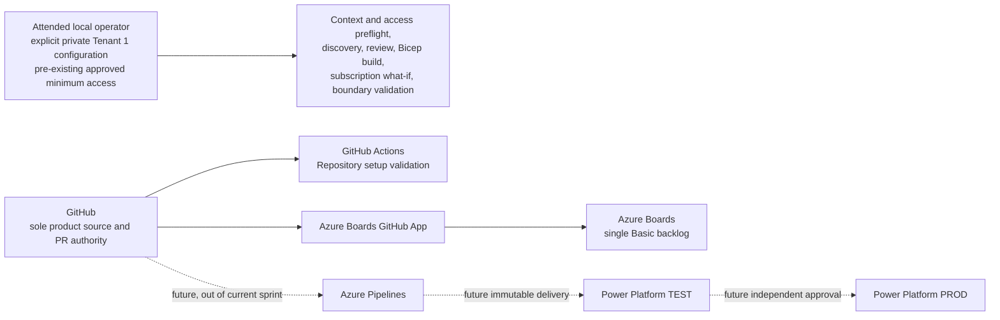

# Tenant 1 Lean Engineering Platform Design

| Field | Value |
|---|---|
| **Version** | 1.9 |
| **Date** | 2026-09-30 |
| **Author** | docs-agent (Voice of Knowledge) |
| **Status** | Approved |
| **Scope** | Tenant 1 lean engineering platform foundation |
| **References** | [Active Tenant 1 Configuration Review](../reviews/2026-09-28-tenant-1-engineering-platform-configuration-review.md), [Configuration Review Design](2026-09-28-tenant-1-engineering-platform-configuration-review-design.md), [Superseded Remediation Design](2026-09-28-tenant-1-engineering-platform-remediation-design.md), [Superseded Foundation Plan](../plans/2026-09-28-tenant-1-engineering-control-plane-foundation-implementation.md), [ADR-0001](../adr/0001-azure-devops-as-engineering-control-plane.md), [ADR-0002](../adr/0002-github-first-bootstrap-and-the-role-of-azure-repos.md), [ADR-0012](../adr/0012-per-tenant-github-repository-and-account-topology.md) |

## Status and Authority

The user explicitly confirmed **Option A — Lean single-tenant platform** through attended approval on 2026-09-28. That approval selects the lean Tenant 1 target and the control dispositions in this document.

Version 1.9 records the pragmatic solo-owner review profile, the attended-access ruling, retirement of the cloud-foundation planner/apply path, payload-level private-boundary isolation, removal of authorization resources from the lean Bicep composition, exact selected-team/current-iteration validation for Boards using the documented Azure DevOps REST 7.1 contract, and the explicit validator-injection boundary for dormant cloud compatibility. Pull requests and successful validation remain mandatory, while required approvals and required CODEOWNERS review are deferred until a second eligible maintainer exists. Local validation uses the attended operator's pre-existing, separately approved least-privilege access and performs no role mutation. The retained generic cloud-foundation modules are dormant compatibility code, not a current-sprint dependency or supported mutation path.

This design supersedes the broader [Tenant 1 Engineering Platform Remediation Design](2026-09-28-tenant-1-engineering-platform-remediation-design.md) and stops the associated [Engineering Control Plane Foundation Implementation Plan](../plans/2026-09-28-tenant-1-engineering-control-plane-foundation-implementation.md).

The [Tenant 1 Engineering Platform Configuration Review](../reviews/2026-09-28-tenant-1-engineering-platform-configuration-review.md) remains **Active** as read-only, point-in-time evidence. Supersession changes the selected response to its findings; it does not alter the review, its counts, or its evidence.

This design approves a target and migration direction. It does not authorize deletion, a cloud mutation, a worktree discard, a role assignment, or a deployment. Each destructive or live action still requires a reviewed lean implementation plan, current pre-state, attended confirmation, exact scope, and read-back.

## Goal and Delivery Boundary

The current goal is a secure, usable Tenant 1 engineering foundation, not an automated multi-tenant bootstrap or a proof that the platform can rebuild itself unattended. Automated bootstrap, rebuildability, and reusable tenant-transition machinery are deferred until a measurable operational need justifies their cost and privilege.

The current sprint establishes:

- GitHub as the sole product-source and pull-request authority;
- Azure Boards as the single delivery backlog;
- one comprehensive GitHub validation workflow;
- minimal, enforced GitHub governance;
- local, attended Tenant 1 discovery and subscription-scope `what-if`;
- a private local Tenant 1 configuration boundary; and
- one real Azure Boards-to-GitHub traceability transaction.

The sprint does not create an Azure Pipeline, deploy infrastructure, import a Power Platform solution, or claim that HR solution CI/CD exists. A future Azure Pipeline connects directly to the GitHub repository and does not require an Azure Repo.

## Lean Topology

The current and future responsibilities are deliberately narrow:



| Surface | Approved responsibility | Current-sprint boundary |
|---|---|---|
| GitHub | Product source, pull requests, governance, and repository validation. | It is the only source authority. GitHub Projects is disabled. |
| Azure Boards | One Basic-process backlog and the durable work item used for proof. | No process conversion or speculative backlog hierarchy is introduced. |
| Azure Boards GitHub App | Native branch, commit, and pull-request linkage and the intended `Fixes AB#` state transition. | It is retained and proven with a real work item. |
| Local operator workstation | Holds the ignored Tenant 1 configuration and runs attended validation. | Private values and raw evidence remain outside Git. |
| Azure Repo | No approved current role. | The empty repository is removed only after attended confirmation that it is still empty and has no branch. |
| Azure Pipelines | Future HR solution CI/CD consuming GitHub directly. | No pipeline, connection, artifact, environment, or run is created this sprint. |
| Power Platform | Future TEST-to-PROD delivery target with independent PROD approval. | No import or deployment is performed or claimed this sprint. |

## Repository Validation

Exactly one active GitHub Actions workflow remains:

```text
.github/workflows/validate-repository.yml
```

It produces the required check named exactly `Repository setup validation` and fails when any required validation fails. Its comprehensive scope is:

1. all repository-owned tests under `.github/cli/tests`;
2. all infrastructure tests under `infra/tests/pester`;
3. all HR tests under `hr/tests/pester`;
4. repository safety checks, including the no-secrets and no-tracked-private-Tenant-1 boundary;
5. compilation of every maintained Bicep entry point; and
6. whitespace validation.

The active `audit-repository.yml`, `discover-tenant.yml`, and `bootstrap-tenant.yml` workflow files are removed during implementation. Active documentation, workflow-specific contracts, and action pins used only by those workflows are removed or retired in the same reviewed change so that no maintained document presents them as supported entry points. Shared tests or code with another current purpose are not deleted merely because a workflow used them.

No separate traceability workflow is created. The pull-request template requires an `AB#` reference, and the reviewer verifies it. The Azure Boards GitHub App, not an additional workflow or credential, proves the real link and transition.

Existing tenant-trust code may remain dormant for future reconsideration. Dormant code is not an active dependency, is not invoked by validation, and must not be described as a current bootstrap path.

The historical cloud-foundation planner and apply entry points are also retired. Their public scripts fail closed before configuration, tool, authentication, file-output, or provider access. Generic module internals may remain only as explicitly dormant compatibility code; active catalogues, runbooks, defaults, validation, and operator procedures do not expose them as supported. Dormant assessment/deployment helpers have no default bridge to the active local private-boundary validator: callers must explicitly inject a compatible `WhatIfValidator`, and missing injection fails closed before deployment mutation. A new reviewed design and implementation plan are required before any such capability can return.

## Tenant 1 Private Configuration

The safe synthetic `infra/src/config/tenants/_template.psd1` remains tracked. The real Tenant 1 configuration is an ignored local file:

```text
infra/src/config/tenants/tenant1.local.psd1
```

The attended Tenant 1 operator owns that file and an encrypted backup stored outside the repository and outside the workstation's primary failure domain. The file contains configuration values only, never credentials or tokens. Access follows least privilege.

Every live PowerShell command receives the file through an explicit:

```powershell
-TenantConfigurationPath 'infra\src\config\tenants\tenant1.local.psd1'
```

There is no default real-tenant path, repository scan, cloud retrieval, or fallback to `_template.psd1`. A live command fails closed before external access when the path is absent, is not a file, resolves to the tracked template, fails schema validation, identifies another tenant, or cannot be read without exposing content.

Before the committed Tenant 1 manifest or discovery evidence is removed, the operator must:

1. export byte-for-byte local copies to the protected local working area;
2. compute SHA-256 hashes locally;
3. copy the files and their hashes to the encrypted external backup;
4. restore them to a separate temporary location and verify the hashes; and
5. confirm that the local configuration can be parsed without logging private values.

The backup and its hashes remain outside Git. Recovery restores `tenant1.local.psd1` from that backup, verifies its hash and schema, and reruns discovery before any `what-if`. Recovery never recommits the private configuration.

The existing Tenant 2 manifest and discovery evidence remain temporarily untouched, outside Tenant 1 operations, under the prior user decision. This sprint does not create a transition package, tenant catalogue, private overlay, handoff workflow, or catalogue automation for Tenant 2.

Path deletion alone does not establish the private boundary. Active source,
workflows, tests, and fixtures must not reproduce protected Tenant 1
operational payload such as tenant, subscription, administrator, Azure DevOps,
Power Platform, or naming values. The repository safety verifier compares
normalized candidate values with non-reversible SHA-256 fingerprints and
reports only an offending path. It never prints the protected value.

Immutable point-in-time audit evidence remains unchanged, and the exact
protected Tenant 2 transition blobs remain outside the payload scan. Those
exceptions are evidence and transition artifacts, not reusable fixtures or
active inputs. Synthetic values are used throughout active tests and fixtures.
`New-TenantManifest.ps1` has no hard-coded Tenant 1 profile, and active
`what-if` expectations are derived from the validated ignored local
configuration and its compiled Bicep parameters rather than repository
constants.

## GitHub Governance

The active `main` ruleset and repository settings enforce only the approved minimum:

- changes to `main` require a pull request;
- the required approving-review count is zero while the repository has only one eligible maintainer;
- CODEOWNERS remains an ownership map but is not a required review gate in the solo-owner profile;
- all review conversations must be resolved;
- `Repository setup validation` is the sole required status check;
- force pushes and branch deletion are blocked;
- squash is the only enabled merge method;
- merged branches are deleted automatically;
- GitHub Projects is disabled; and
- Dependabot security updates are enabled.

The pull-request template requires the author to identify the Azure Boards work item. Human review verifies that the final proof uses the literal `Fixes AB#` prefix followed by the selected Issue's positive integer ID. This intentionally avoids a second required check and does not claim that template text is machine enforcement.

When a second eligible maintainer is added, changing the required approving-review count to one and requiring CODEOWNERS review is a separately reviewed repository-governance update, not an automatic side effect.

## Azure Boards Operating Model

Tenant 1 keeps the built-in **Basic** process and its native hierarchy:

```text
Epic
└─ Issue
   └─ Task
```

The existing team and project-root area remain. Only the current sprint receives dates, and only after those dates are agreed and read back. The sprint does not convert Basic to Agile, generate six iterations, create a second team or area, or add a separate remediation-hierarchy script.

Before planning any Boards mutation, the operation reads the selected team's
area settings and the team current-iterations endpoint with the literal query
key `$timeframe=current`. The documented response must contain a `values`
array. The team must have exactly the project-root area and
exactly one current iteration whose full path equals `CurrentSprintPath`.
Missing, multiple, malformed, or mismatched state stops before issue planning
or mutation. A valid project classification node alone is not sufficient.

One real, durable Basic **Issue** is used for the `Fixes AB#` proof. It is not deleted after validation. Existing tooling for the separate 19-idea Epic portfolio remains optional and is not a prerequisite for the lean foundation.

## Identity, Trust, and Private Azure Repo

The current sprint has no bootstrap Entra application, service principal, federated credential, or `bootstrap-tenant1` GitHub Environment. It performs no cloud tenant-configuration retrieval and does not execute `Initialize-TenantTrust`.

The empty Azure Repo has no approved lean-platform dependency. Before deletion, the Azure DevOps project administrator must attend a fresh read-back that proves the repository is still empty and has no branch or default branch. Any content, branch, ambiguity, failed read, `403`, `404`, or indeterminate result stops deletion. The approved deletion must target the exact repository ID. This design alone does not authorize that deletion.

Future Azure Pipelines connects directly to GitHub. If later evidence establishes a need for a private configuration repository, OIDC bootstrap, separate delivery identities, or required templates, those controls return through a new reviewed design rather than by reviving the superseded plan.

## Attended Local Validation Sequence

The local sequence is fixed:

1. **Attended-context and minimum-access preflight** — identify the signed-in user, confirm the exact Tenant 1 tenant and subscription, and verify that separately approved pre-existing access is available before discovery or `what-if`.
2. **Discovery** — use the explicit private configuration and read current Tenant 1 state without mutation.
3. **Sanitized review** — inspect the discovery result locally, remove private values from any shareable summary, and confirm the intended subscription and boundary.
4. **Bicep build** — compile the maintained Bicep entry points before contacting the deployment API.
5. **Subscription `what-if`** — use the attended operator's pre-existing, separately approved least-privilege access to run subscription-scope `what-if` only; do not execute deployment create.
6. **Boundary and access read-back** — prove no Tenant 1 private value is tracked, Tenant 2 files were not changed or selected, the attended principal and subscription did not change, and all operations remained in the approved Tenant 1 scope.

Local scripts fail closed on missing explicit configuration, tenant or subscription mismatch, missing or excessive access evidence, ambiguous resource resolution, failed authentication, incomplete read-back, timeout, unsupported capability, or an unexpected plan. They do not interpret `403`, `404`, an empty response, or an indeterminate result as permission to continue.

This sprint creates, changes, and deletes no role assignment. The operator's access is provisioned and approved outside this sprint; the preflight and read-back validate context and minimum necessary capability without making authorization changes.

The lean Bicep composition contains no role-definition or role-assignment
resource, input, or output. Its generated parameter contract contains no
principal or validation-role field. `what-if` validation rejects every
`Microsoft.Authorization/roleDefinitions` or
`Microsoft.Authorization/roleAssignments` Create, Modify, or Delete result.
The exact pre-existing user-or-group assignment and custom-role contract are
validated before and after `what-if` by the attended PowerShell preflight, not
created by deployment code.

No command in this sequence creates a deployment. `what-if` output is reviewed and sanitized; it is not proof that resources were deployed.

## Final End-to-End Proof

The sprint uses one real delivery transaction:

1. Select or create a durable Azure Boards Basic Issue.
2. Create a real branch and pull request for an approved repository change.
3. Put the literal `Fixes AB#` prefix followed by the selected Issue's positive integer ID in the pull-request body.
4. Pass the single `Repository setup validation` workflow.
5. Confirm successful validation and resolve all conversations; no approving review is required under the current solo-owner profile.
6. Squash-merge the pull request through the protected branch.
7. Verify that the source branch was deleted.
8. Read back the Azure Boards GitHub link and intended Issue state transition.
9. Verify that `main` is green at the merged commit.

The proof fails if the work item is synthetic or deleted, the link or transition is inferred rather than read back, another workflow is required, the branch is not deleted, or `main` is not green.

## Control Disposition

| Disposition | Controls |
|---|---|
| **Retained now** | No secrets or Tenant 1 private values in Git; pull requests; CODEOWNERS ownership mapping; resolved conversations; required repository validation; force-push and deletion protection; attended-context and minimum-access preflight/read-back; subscription `what-if`; post-action read-back; Azure Boards GitHub App; future independent PROD approval. Required repository approval is deferred until a second eligible maintainer exists. |
| **Removed from the current sprint and deferred** | OIDC bootstrap and the `bootstrap-tenant1` Environment; workflow-hosted cloud discovery; cloud bootstrap; cloud-foundation planner/apply entry points; advisory audit workflow; separate traceability workflow; private configuration Azure Repo; Azure DevOps Required template delivery control; Basic-to-Agile conversion; multi-iteration automation; separate bootstrap, non-production, and production identities. |
| **Retained but dormant** | Existing trust code and generic cloud-foundation module internals that have plausible future compatibility value and can remain without becoming active dependencies or supported operator paths. |

All deferred controls require measurable need and a new review. Their prior presence in code or documentation is not approval to execute them. The retained `_template.psd1` is a safe local configuration example and is unrelated to the deferred Azure DevOps Required template control.

## Accepted Tradeoffs

| Choice | Accepted cost |
|---|---|
| Local attended configuration | Rebuilds depend on an operator and a tested external backup; unattended bootstrap is unavailable. |
| One comprehensive workflow | A single workflow has a larger validation blast radius and may run longer, but avoids duplicated setup and competing required checks. |
| Pull-request template and human `AB#` review | Traceability syntax can be missed before review; the real Boards transaction and reviewer are the control rather than a second workflow. |
| No advisory audit workflow | There is no scheduled repository audit. Required validation on changes, ruleset read-back, and attended local checks carry the current risk. |
| Basic Boards | The backlog lacks Agile Feature/User Story semantics and generated cadence, but matches the current project and avoids disruptive conversion. |
| No current OIDC or bootstrap identity | There is no unattended cloud bootstrap, role mutation, or cloud configuration retrieval; the attended operator's separately approved pre-existing access remains a dependency. |
| No private Azure Repo | Tenant configuration is not centrally versioned. The secure local backup and recovery check are mandatory compensating controls. |
| Dormant trust code | Dormant code may drift. It must remain outside the active dependency graph and be reassessed before reuse. |
| Deferred multi-tenant automation | A new tenant or rebuild takes longer and requires an attended design; current complexity and privilege are lower. |

## Migration from the Superseded Design

1. Pause execution of the superseded SDD plan.
2. Preserve Task 1's attended decision history. Revise ADR-0001, ADR-0002, ADR-0012, their catalogue, and affected references to the lean outcome through a separate reviewed documentation change; do not present the old private-repository and bootstrap decisions as current.
3. Before lean implementation, selectively revert the Task 2 implementation commit `6b9eaa6` while preserving unrelated work and any behavior retained by this design.
4. The current uncommitted Task 2 fix in `infra/tests/pester/CloudFoundationStaticSafety.Tests.ps1` is outside this documentation change. Discard it only as a separately attended migration action after confirming the exact diff; do not overwrite it incidentally.
5. Complete and verify the local Tenant 1 configuration backup before removing tracked Tenant 1 manifest or evidence files.
6. Implement the one-workflow, explicit-local-path, Basic Boards, and minimal-governance target through a new lean plan.
7. Remove the three obsolete workflows and only their unused active contracts, documentation, and action pins.
8. Consider deletion of the empty Azure Repo only after the attended empty/no-branch read-back and separate authorization.

No step above is a live or destructive authorization. In particular, this documentation change does not perform or authorize the selective revert, worktree discard, file deletion, workflow deletion, Azure Repo deletion, role change, or cloud mutation.

## Ownership, Evidence, and Risks

| Owner | Responsibility |
|---|---|
| Repository owner | GitHub workflow inventory, ruleset and settings, source authority, and recovery of repository-only changes. |
| Tenant 1 attended operator | Local configuration, encrypted backup and recovery test, attended-context and minimum-access preflight/read-back, discovery, Bicep build, `what-if`, and sanitized review. |
| Azure DevOps project administrator | Basic Boards settings, current sprint dates, Azure Boards GitHub App read-back, and any separately approved empty-repository deletion. |
| Pull-request author and attended repository owner | Correct `Fixes AB#` reference, conversation resolution, successful validation, and final proof completeness. |
| Future release owner and independent approver | A later Azure Pipelines and PROD-approval design; no current-sprint deployment responsibility is implied. |

Raw discovery, local configuration, tenant identifiers, unrestricted identity listings, tokens, and access-assignment details remain outside Git. Repository evidence is limited to sanitized outcomes needed to prove the acceptance criteria. Private-file hashes remain with the protected backup unless a separate evidence review determines that publishing a hash cannot disclose or correlate private state. The active audit review and its generated evidence are not edited by this design.

| Risk | Owner | Required response |
|---|---|---|
| Local configuration or workstation loss | Tenant 1 attended operator | Maintain an encrypted backup in a separate failure domain and prove restore by hash before tracked files are removed. |
| Private Tenant 1 value enters Git | Repository owner | Fail validation, block merge, remove the value from history through a separately approved incident procedure, and rotate any exposed credential. |
| Wrong tenant or subscription is targeted | Tenant 1 attended operator | Require explicit path and context match; stop before external action on mismatch or ambiguity. |
| Attended access is missing, excessive, or changes during validation | Tenant 1 attended operator | Stop before `what-if`, preserve the separately approved access record outside Git, and require a matching minimum-access preflight and post-operation read-back. Do not mutate roles in this sprint. |
| Human `AB#` review is missed | Pull-request author and reviewer | Block approval until corrected and require real Boards link/state read-back in final proof. |
| One large validation workflow becomes slow or brittle | Repository owner | Measure duration and failure causes; split it only after evidence shows a need and the required-check contract is redesigned. |
| Dormant trust code is mistaken for supported behavior | Repository owner | Remove active references and test invocations; require a new design before reuse. |
| Empty Azure Repo contains unexpected state | Azure DevOps project administrator | Stop deletion, preserve the repository, and return for review. |

## Validation and Rollback

Repository changes use a normal pull request and the single required validation workflow. Before any live setting change, capture sanitized pre-state and the exact stable resource identifier. After each approved setting change, read back the complete affected setting. A mismatch stops the sequence.

Rollback is scoped by surface:

- Repository workflow, template, documentation, and desired-state changes are restored through a reviewed Git revert or corrective pull request.
- GitHub settings and ruleset changes use captured pre-state and exact read-back; restoration is attended and targets the same stable resource.
- Basic Boards changes use captured current-sprint pre-state. No work item is deleted to simulate rollback.
- The local private configuration is recovered from the encrypted external backup and verified by hash and schema; it is never restored to Git.
- Cloud-foundation planner/apply entry points fail closed before any configuration, file, tool, authentication, or provider access; no active catalogue, runbook, default, validation path, or operator procedure presents them as supported.
- Active source, workflows, tests, and fixtures contain no protected Tenant 1 operational-payload fingerprint; scans disclose only paths, preserve immutable point-in-time audit evidence and exact protected Tenant 2 blobs, and use synthetic active fixtures.
- The Tenant 1 profile cannot be regenerated from tracked source, and `what-if` validation derives the expected tenant, subscription, naming, and resource contract from validated ignored local configuration plus compiled parameters.
- Lean Bicep and generated-parameter contracts contain no role definition, role assignment, validation-role, or principal resource contract; authorization changes in `what-if` are rejected while exact pre-existing user/group access is proven outside deployment code.
- The Azure Repo is not deleted unless its lack of content and branches makes content recovery unnecessary. A later need creates a newly approved repository design rather than assuming deleted configuration can be recovered.
- No infrastructure or Power Platform deployment rollback exists in this sprint because deployment create is prohibited.

## Sprint Acceptance

The lean foundation is accepted only when all of the following are true:

- exactly one active GitHub Actions workflow exists: `.github/workflows/validate-repository.yml`;
- the minimal `main` ruleset and repository settings are active and read back;
- the Azure Boards GitHub App connection and one real `Fixes AB#` link and state transition are proven;
- the selected Boards team has exactly the project-root area and exactly one current team iteration whose full path equals the approved sprint path before any mutation is planned;
- attended-context and minimum-access preflight/read-back, local discovery, Bicep build, subscription `what-if`, and boundary validation pass without role mutation;
- Bicep composition and generated parameters contain no authorization resource or principal contract, and authorization changes in `what-if` fail closed;
- no Tenant 1 private value, local configuration, or raw discovery evidence is tracked;
- no bootstrap identity, federated credential, `bootstrap-tenant1` Environment, or cloud configuration retrieval is required;
- the final pull request is approved, squash-merged, its branch is deleted, and `main` is green; and
- no Azure Pipeline, Power Platform deployment, or infrastructure deployment is created or claimed.

## Non-Goals

This design does not:

- automate multi-tenant bootstrap, tenant seeding, transition packages, rebuildability, or private-overlay catalogues;
- alter, migrate, package, or validate the existing Tenant 2 files;
- create or execute cloud bootstrap, trust initialization, an OIDC federation, or separate delivery identities;
- convert Azure Boards to Agile, create six iterations, or replace the optional 19-idea Epic tooling;
- create a private configuration repository, required delivery template, Azure Pipeline, service connection, artifact, or deployment environment;
- implement Power Platform CI/CD or import a solution;
- create an infrastructure deployment;
- replace or rewrite the active read-only audit review; or
- authorize destructive cleanup or a live mutation without a separate reviewed plan and attended approval.
