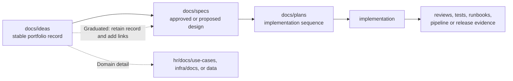

# Documentation Knowledge Architecture Cleanup Design

| Field | Value |
|---|---|
| **Version** | 1.0 |
| **Date** | 2026-10-02 |
| **Author** | docs-agent (Voice of Knowledge) |
| **Status** | Approved |
| **Scope** | Repository documentation knowledge architecture and migration |
| **References** | [Documentation Policy](../README.md), [Specifications Catalogue](README.md), [Repository-Agent Portfolio Governance Design](2026-10-02-hr-frontier-copilot-agent-portfolio-governance-design.md), [HR Domain](../../hr/README.md), [Infrastructure Domain](../../infra/README.md), [Data Domain](../../data/README.md) |

## 1. Status and Authority

This approved design defines the target knowledge architecture, migration boundary, navigation contract, and acceptance criteria for the repository's documentation cleanup. The design sections and rollout order were approved on 2026-10-02.

This document is the implementation authority for a later, dedicated documentation-cleanup plan. It does not perform or authorize unplanned file movement, deletion, validator creation, agent-profile implementation, policy implementation, pipeline creation, or live-system mutation.

The cleanup is a prerequisite for implementing the repository-agent portfolio. The companion [Repository-Agent Portfolio Governance Design](2026-10-02-hr-frontier-copilot-agent-portfolio-governance-design.md) remains authoritative for agent roles and controls; this specification is authoritative for documentation placement, lifecycle navigation, catalogue behavior, and the migration needed before those profiles are implemented.

The intended audience is the repository owner, Docs Agent, domain owners, implementation-plan author, migration reviewer, and later repository-agent implementers.

## 2. Context and Findings

The tracked tree contains **139 Markdown files** across `docs/`, `hr/`, `infra/`, and `data/`. The inventory found no byte-identical Markdown duplicates. The defect is therefore not duplicated bytes; it is overlapping taxonomy, incomplete navigation, and unclear authority.

The approved inventory established these concrete gaps:

- `docs/specs/` contains 15 non-README files, while its catalogue lists only 7.
- `docs/plans/` contains 15 non-README files, while its catalogue lists only 9.
- `docs/superpowers/` contains 2 active specifications and 5 active plans but has no README.
- `docs/operating-model/` contains 6 superseded documents but has no README.
- `docs/brandkit/` and several generic `docs/` folders contain only placeholder READMEs.
- HR ideas, detailed use-case material, repository-wide specifications, repository-wide plans, and historical snapshots are split across roots that do not consistently express their authority.

The inventory is a point-in-time baseline for planning. The migration review manifest defined below becomes the implementation evidence; it is not a second permanent catalogue.

## 3. Design Goals and Principles

The cleanup must:

1. provide one deterministic route from repository instructions to the governing artifact;
2. establish one repository-wide lifecycle and one root for each lifecycle stage;
3. separate central portfolio records from domain detail;
4. preserve stable idea records after graduation;
5. retain historical evidence without presenting it as active authority;
6. make every authoritative folder README a complete, lean routing surface;
7. preserve immutable bytes and hashes where evidence depends on them;
8. repair active references, tests, and generators atomically with path changes;
9. leave Azure Boards untouched until a later, evidence-backed rebuild; and
10. create no redirect stubs, duplicate catalogues, or new GitHub Actions.

Three alternatives are rejected:

| Alternative | Reason rejected |
|---|---|
| Keep the current roots and improve prose only. | Navigation would still expose competing idea, specification, plan, and historical roots. |
| Put each domain's ideas, specifications, and plans entirely below that domain. | Portfolio discovery and lifecycle governance would remain fragmented, and cross-cutting work would have no deterministic home. |
| Leave redirect stubs at retired paths. | Stubs preserve ambiguity, weaken retired-path validation, and create documents whose only purpose is to perpetuate the old taxonomy. |

## 4. Target Knowledge Architecture

### 4.1 Repository-Wide Lifecycle

The canonical lifecycle is:



`docs/ideas/` is the central portfolio for every idea regardless of domain. Each idea has a stable file. Graduation does not delete or replace that record: its status becomes `Graduated`, and it links to the governing specification, domain detail, and implementation plan.

`docs/specs/` and `docs/plans/` are the only repository-wide specification and plan roots. Designs and plans may govern one domain, but their lifecycle records remain in these central roots.

Implementation and evidence remain with their owning system:

- durable reviews and migration evidence in `docs/reviews/`;
- domain tests and source beside the implementation they validate;
- infrastructure runbooks in `infra/docs/`;
- release and pipeline evidence in the approved delivery system; and
- historical snapshots in `docs/archive/`.

### 4.2 Domain Ownership

Central lifecycle records do not absorb domain detail.

| Domain root | Owns | Does not own |
|---|---|---|
| `hr/docs/use-cases/` | Detailed HR PRDs, business rules, bills of materials, model setup, test design, processing architecture, and related use-case documents. | The central portfolio idea record or repository-wide specification and plan catalogues. |
| `infra/docs/` | Infrastructure detail, operational controls, and runbooks. | Repository-wide idea, specification, and plan roots. |
| `data/` | Mappings, contracts, controlled reference data, and synthetic test-data guidance. | Real personal data or HR process requirements. |
| `docs/archive/` | Superseded snapshots retained for historical or audit value, plus current archive navigation. | Active authority or content edited to appear current. |

Operational superseded stop notices remain in their current `infra/` paths when retaining the path protects operators from invoking a dormant or unsupported operation. Historical cleanup must not remove a safety control merely because its status is superseded.

### 4.3 Active and Historical Material

Active documents are maintained, link-validated, catalogued, and interpreted according to their metadata status. Archive snapshots are retained as historical evidence and are not implementation authority.

Only the eight hash-pinned Phase 2 snapshots moved by this design are excluded from live-link validation because a byte-preserving move necessarily leaves their relative links unchanged. The new archive README and every active document remain fully link-validated.

### 4.4 Canonical Tree

The target routing tree is:

```text
.github/copilot-instructions.md
docs/
├── README.md
├── ideas/
│   └── README.md
├── specs/
│   └── README.md
├── plans/
│   └── README.md
├── reviews/
│   └── README.md
├── archive/
│   ├── README.md
│   └── phase-2-operating-model/
│       └── README.md
├── adr/
├── brand/
├── prd.md
├── solution-design.md
└── hr-journey-and-raci.md
hr/
├── README.md
└── docs/
    └── use-cases/
        └── README.md
infra/
├── README.md
└── docs/
    └── README.md
data/
└── README.md
```

This is an authority and navigation view, not a complete source-tree inventory. Source, test, evidence, and generated-artifact folders remain under their owning domains.

## 5. Canonical Reading Path and Authority

### 5.1 Deterministic Reading Path

Every contributor and repository agent follows this route:

`.github/copilot-instructions.md -> docs/README.md -> lifecycle catalogue -> domain README -> selected artifact and its explicit references`

The steps have distinct purposes:

1. `.github/copilot-instructions.md` establishes repository workflow and directs the reader to the knowledge map.
2. `docs/README.md` is the repository knowledge map.
3. `docs/ideas/README.md`, `docs/specs/README.md`, or `docs/plans/README.md` identifies the lifecycle record and status.
4. The owning domain README explains domain authority and routes to domain detail.
5. The selected artifact and its explicit references provide the substantive contract and evidence.

A README routes and catalogues. It does not restate child documents or become a parallel source of substantive requirements.

### 5.2 Authority and Conflict Order

Navigation order is not itself an authority override. When maintained records conflict, use this order:

1. law, organizational governance, and explicit human authority;
2. Accepted or Approved policies, ADRs, and specifications;
3. approved platform requirements and cross-cutting governance;
4. the more specific domain or use-case contract, provided it does not weaken higher governance;
5. the approved implementation plan for the selected specification; and
6. evidence of the implemented state.

Status is checked before content. `Superseded`, `Draft`, `Proposed Baseline`, `Idea`, and `Graduated` material cannot silently override an Approved or Accepted authority. README catalogue text is a routing aid; if it conflicts with an authoritative child, the child wins and the README is repaired.

For a question about what currently exists or passed, current reproducible evidence controls; an approved design or plan defines intent but never proves implementation.

## 6. README and Catalogue Contract

Every authoritative documentation folder has a `README.md` with the standard six-field metadata header and these sections or equivalent clearly labelled content:

1. **Purpose and authority** — why the folder exists and what decisions its contents can govern.
2. **Contains / does not contain** — positive and negative placement rules.
3. **Reading order** — where the reader came from and what to read next.
4. **Naming and lifecycle** — filename rules, allowed statuses, graduation or supersession behavior.
5. **Complete curated direct-child catalogue** — every maintained direct child, without recursively duplicating descendant catalogues.
6. **Domain links** — relevant platform, HR, infrastructure, data, archive, or lifecycle entry points.
7. **Board synchronization state where relevant** — one of `Not applicable`, `Deferred - not synchronized`, or a verified Board identifier and link.

Catalogue rows include:

- stable ID or filename;
- metadata status;
- concise purpose;
- authority;
- successor or next-stage link.

The catalogue must be complete but curated: generated files, binary corpus items, and descendant records belong in their nearest owning README rather than being flattened into every ancestor.

The Docs Agent owns placement, naming, metadata, catalogue completeness, successor links, and archive navigation. Creating, moving, superseding, or graduating a document updates its owning README in the same pull request.

`docs/README.md` is the knowledge map. Its implementation must cover lifecycle, question routing, authority and conflict order, the canonical tree, active versus archive material, domain entry points, and the direct-child catalogue-completeness policy.

No current Azure Boards link is required for this cleanup. Central idea records explicitly show `Deferred - not synchronized`; they do not preserve, create, infer, or change current Board IDs or configuration. A later sprint will rebuild Boards from the cleaned idea catalogue and add only verified links.

## 7. Approved Migration Map

All moves use `git mv`. The implementation must not create redirect stubs.

### 7.1 Central Ideas and HR Use-Case Detail

| Current path or set | Target | Disposition |
|---|---|---|
| `docs/ideas/README.md` | Same path | Replace the placeholder with the complete repository-wide idea catalogue and lifecycle contract. |
| `hr/docs/ideas/README.md` | `docs/ideas/README.md` | Merge current portfolio knowledge into the central catalogue; do not retain a second catalogue. |
| `hr/docs/ideas/uc-0002-*.md` through `uc-0019-*.md` | `docs/ideas/` | Move each flat idea byte-preservingly unless an active-reference repair requires a separately reviewed metadata or status update. |
| `hr/docs/ideas/hr-control-plane-mockup-idea.md` and its HTML companion | `docs/ideas/` | Move the central idea and its companion together. |
| `hr/docs/ideas/uc-0001-personal-master-data-completion-agent/uc-0001-personal-master-data-completion-agent.md` | `docs/ideas/uc-0001-personal-master-data-completion-agent.md` | Retain the stable central idea record and mark it `Graduated` with links to domain detail, governing specification, and plan. |
| Remaining contents of `hr/docs/ideas/uc-0001-personal-master-data-completion-agent/` | `hr/docs/use-cases/uc-0001-personal-master-data-completion-agent/` | Move the detailed PRD, BoMs, model setup, architecture, test guidance, READMEs, generators, truth files, PDFs, and related package content together. |
| `hr/docs/ideas/` | Retired | Remove only after all active references and contracts use the central idea or HR use-case roots. |

The 48 synthetic corpus PDFs and all other moved UC-0001 binary artifacts retain their bytes. The seven immutable evaluation-evidence PDFs below `hr/evidence/ai-builder/` remain at their current paths and also retain their bytes. Path-based scripts, tests, generators, safety checks, READMEs, and evidence consumers are updated to the new use-case root. Before-and-after hashes are recorded and compared.

### 7.2 Repository-Wide Specifications and Plans

| Current path | Target |
|---|---|
| `docs/superpowers/specs/2026-09-25-tenant-2-ai-builder-models-design.md` | `docs/specs/2026-09-25-tenant-2-ai-builder-models-design.md` |
| `docs/superpowers/specs/2026-09-29-ai-builder-evaluation-capture-design.md` | `docs/specs/2026-09-29-ai-builder-evaluation-capture-design.md` |
| `docs/superpowers/plans/2026-09-25-tenant-2-ai-builder-models-implementation.md` | `docs/plans/2026-09-25-tenant-2-ai-builder-models-implementation.md` |
| `docs/superpowers/plans/2026-09-26-runbook-cloud-foundation.md` | `docs/plans/2026-09-26-runbook-cloud-foundation.md` |
| `docs/superpowers/plans/2026-09-26-runbook-customer-handover.md` | `docs/plans/2026-09-26-runbook-customer-handover.md` |
| `docs/superpowers/plans/2026-09-26-runbook-foundation-workstation.md` | `docs/plans/2026-09-26-runbook-foundation-workstation.md` |
| `docs/superpowers/plans/2026-09-29-ai-builder-evaluation-capture-implementation.md` | `docs/plans/2026-09-29-ai-builder-evaluation-capture-implementation.md` |

After references, catalogues, and tests use the canonical roots, remove `docs/superpowers/`. During implementation, add a repository override to `.github/copilot-instructions.md`: vendored Superpowers remains unchanged, while this repository stores specifications in `docs/specs/` and plans in `docs/plans/`.

The override applies only to repository-owned placement. No file below the vendored `.github/skills/` Superpowers snapshot is changed.

### 7.3 Immutable Historical Archive

The following files move byte-for-byte to `docs/archive/phase-2-operating-model/`:

| Current path | Archive path |
|---|---|
| `docs/operating-model/00-north-star.md` | `docs/archive/phase-2-operating-model/00-north-star.md` |
| `docs/operating-model/01-prd.md` | `docs/archive/phase-2-operating-model/01-prd.md` |
| `docs/operating-model/02-system-design.md` | `docs/archive/phase-2-operating-model/02-system-design.md` |
| `docs/operating-model/03-agent-operating-model.md` | `docs/archive/phase-2-operating-model/03-agent-operating-model.md` |
| `docs/operating-model/04-hitl-governance.md` | `docs/archive/phase-2-operating-model/04-hitl-governance.md` |
| `docs/operating-model/05-implementation-roadmap.md` | `docs/archive/phase-2-operating-model/05-implementation-roadmap.md` |
| `docs/90-microsoft-best-practice-evaluation.md` | `docs/archive/phase-2-operating-model/90-microsoft-best-practice-evaluation.md` |
| `hr/docs/20-hr-employee-journey.md` | `docs/archive/phase-2-operating-model/20-hr-employee-journey.md` |

Create `docs/archive/phase-2-operating-model/README.md` as a current, link-validated navigation document. It identifies the snapshots as non-authoritative and maps them to current replacements, including `docs/prd.md`, `docs/solution-design.md`, `docs/hr-journey-and-raci.md`, current ADRs, the central idea portfolio, and relevant domain documentation. Where no current evaluation replaces the historical Microsoft assessment, the README says so rather than inventing equivalence.

`Phase2SourceContract.Tests.ps1` keeps the original source-inventory paths and hashes as then-current evidence, updates current target-path assertions to the archive paths, and verifies the moved bytes against the retained hashes. `docs/reviews/2026-09-17-architecture-baseline-source-inventory.json` remains unchanged.

### 7.4 Canonical Brand and Placeholder Roots

| Path | Disposition |
|---|---|
| `docs/brand/` | Retain as the only canonical brand documentation root. |
| `docs/brandkit/` | Remove the placeholder-only root after confirming no active reference treats it as canonical. |
| `docs/business/` | Remove the placeholder-only root. |
| `docs/delegation/` | Remove the placeholder-only root. |
| `docs/issues/` | Remove the placeholder-only root. |
| `docs/sprints/` | Remove the placeholder-only root. |
| `docs/templates/` | Remove the placeholder-only root. |
| `docs/archive/` | Retain and populate; it is not a placeholder root. |

The implementation also rebuilds the `docs/specs/` and `docs/plans/` catalogues to include every maintained direct child and adds or updates READMEs for every maintained documentation folder.

## 8. Reference Repair and Historical Mentions

Path migration and reference repair are one change. The implementation updates active Markdown links, `.github/copilot-instructions.md`, agent instructions, issue forms, scripts, tests, generators, repository safety checks, and domain navigation before retiring an old root.

Active control surfaces may not mention a retired path. In particular:

- issue forms and active infrastructure documents that route to superseded HITL or HR documents are updated to current platform policy and domain authority;
- AI Builder corpus and path tests use `hr/docs/use-cases/`;
- profile and instruction reading paths use the canonical navigation chain; and
- active specifications and plans use `docs/specs/` and `docs/plans/`.

Historical plans, reviews, and the source inventory may retain old paths when they describe then-current facts. Every allowed old-path mention is explicit and narrow. It must identify a historical record or immutable snapshot; broad folder-level exceptions are prohibited.

## 9. Migration Evidence

Implementation creates:

`docs/reviews/2026-10-02-documentation-knowledge-architecture-migration-review.md`

The review manifest records, for every moved, removed, merged, or retained migration item:

- old path;
- new path, if any;
- class and metadata status;
- before and after SHA-256;
- active replacement;
- references, tests, or generators updated;
- disposition; and
- exception or failure notes.

The manifest is migration evidence, not a second permanent catalogue. After acceptance, normal discovery uses the lifecycle and domain READMEs.

## 10. Safety and Error Handling

The migration fails closed.

| Condition | Required response |
|---|---|
| A target path already exists with different content. | Stop that slice; do not overwrite or merge implicitly. Record the collision and obtain a reviewed disposition. |
| A byte-preserving move changes a file hash. | Stop, restore the original bytes, and investigate before continuing. |
| A moved PDF or evidence artifact has a hash mismatch. | Block the UC-0001 slice; do not regenerate the artifact as a substitute. |
| An active reference still uses a retired root. | Keep the retirement blocked until the reference or a narrow historical allowlist is reviewed. |
| A catalogue omits or duplicates a maintained direct child. | Fail navigation validation and repair the owning README. |
| Metadata status and catalogue status disagree. | Treat the artifact metadata as the current source, block acceptance, and reconcile through review. |
| A proposed archive-link exclusion includes an active file or archive README. | Reject the exclusion; only the eight named hash-pinned snapshots qualify. |
| A Board ID, link, work item, or configuration would change. | Stop the affected action. This sprint is documentation-only and Boards-neutral. |
| A validation failure occurs after a slice. | Do not proceed to a dependent slice; preserve evidence and repair or revert the bounded slice. |

Git history is the change log. The migration does not add in-document change logs and does not rewrite repository history.

## 11. Validation and Acceptance

Implementation adds `.github/cli/tests/DocumentationNavigation.Tests.ps1`. The contract verifies:

1. canonical lifecycle and domain roots exist;
2. retired roots are absent;
3. every maintained documentation folder has a README;
4. each README's direct-child catalogue is complete;
5. catalogue statuses match artifact metadata;
6. central idea rows contain stable identity, status, purpose, authority, successor or next stage, and Board synchronization state;
7. active references avoid retired paths;
8. remaining old-path mentions are narrowly allowlisted historical facts;
9. the eight archive snapshot hashes and all moved binary hashes are preserved;
10. active links and required metadata are valid;
11. instructions and later profiles use the canonical reading order;
12. Azure Boards content and configuration are untouched; and
13. no GitHub Action was added.

Acceptance runs, at minimum:

- `DocumentationMetadata.Tests.ps1`;
- `DocumentationLinks.Tests.ps1`, with only the eight immutable snapshots excluded from live-link checks;
- `DocsAgentContract.Tests.ps1`;
- the new `DocumentationNavigation.Tests.ps1`;
- `Phase2SourceContract.Tests.ps1`;
- `IssueFormContract.Tests.ps1`;
- `RepositorySafety.Tests.ps1` and `BrandingContract.Tests.ps1`;
- AI Builder corpus, evidence, generator, and path tests;
- binary and evidence hash comparison; and
- the full repository Pester suite.

The archive README, all lifecycle and domain READMEs, the migration review, and every active document remain within normal metadata and link validation.

No validation is added as a GitHub Action. Future CI/CD remains owned by Azure DevOps Pipelines under the [Repository-Agent Portfolio Governance Design](2026-10-02-hr-frontier-copilot-agent-portfolio-governance-design.md).

## 12. Rollout

The later implementation plan uses six reviewable slices:

1. **Inventory and manifest baseline** — freeze the tracked-path inventory, classify active/history/placeholder content, and record pre-move hashes.
2. **Central ideas and HR use cases** — establish `docs/ideas/`, move flat ideas, separate the UC-0001 central record from domain detail, and verify all corpus and evidence hashes.
3. **Superpowers consolidation and instruction override** — move the two specifications and five plans, rebuild both catalogues, add the repository placement override, and leave vendored skills untouched.
4. **Immutable archive and active governance repair** — move the eight snapshots byte-for-byte, add archive navigation, update Phase 2 current-path assertions, and repair issue-form and infrastructure authority links.
5. **Placeholder removal and README rebuild** — remove only approved placeholder roots, retain operational stop notices, and complete knowledge-map, lifecycle, domain, and archive navigation.
6. **Navigation validation and full acceptance** — add the navigation contract, run targeted and full validation, complete the migration review, and confirm Boards and GitHub Actions are unchanged.

Each slice records pre-state, post-state, hashes, affected references, targeted validation, and rollback. A dependent slice starts only after its predecessor passes.

## 13. Risks and Tradeoffs

| Risk or tradeoff | Position |
|---|---|
| Central lifecycle roots can appear to weaken domain ownership. | Central records route lifecycle; domain READMEs and detail remain authoritative for domain substance. |
| No redirect stubs means stale links fail immediately. | This is deliberate: migration repairs active references atomically and validation exposes omissions instead of preserving ambiguity. |
| Byte-preserving archive snapshots contain broken relative links. | Exclude only the eight named snapshots from live-link validation and provide a current, validated archive README. |
| A large move can silently alter binary or generated artifacts. | Pin before/after hashes and block regeneration as a substitute for preservation. |
| Complete catalogues add maintenance work. | Keep them direct-child and curated; enforce same-PR updates through the Docs Agent contract and navigation test. |
| Deferring Boards temporarily removes external backlog links. | The repository catalogue remains authoritative for ideas until a later sprint rebuilds Boards and adds verified links. |
| Historical old-path allowlists can grow into loopholes. | Require exact files and contexts; active control surfaces receive no exemption. |
| The cleanup delays agent-profile delivery. | Clear authority and deterministic navigation are prerequisites for safe profile scopes and outweigh starting profiles against unstable paths. |

## 14. Non-Goals

This design does not:

- implement the moves, deletions, README rebuild, archive, manifest, validators, reference repairs, or test changes;
- create or edit repository-agent profiles;
- implement policies, pipelines, tenant settings, or product behavior;
- create a GitHub Action;
- preserve, create, rebuild, link, or modify an Azure Boards item or configuration;
- change vendored Superpowers content;
- rewrite the historical source inventory or repository history;
- edit immutable archive snapshots to repair their internal links;
- remove operational superseded stop notices whose current path protects operators;
- promote Proposed Baseline, Draft, Idea, or Superseded content without reviewed evidence; or
- create the implementation plan for this design in the current change.

## 15. Dependencies and Entry Criteria

The cleanup implementation depends on:

- this approved design;
- a separate future implementation plan with exact paths, commands, tests, hash capture, and rollback;
- a clean classification of active, historical, generated, vendored, and binary artifacts;
- Git history and `git mv` for traceable moves;
- current owners for platform, HR, infrastructure, data, and repository-agent documentation; and
- the existing metadata, link, Docs Agent, source-contract, issue-form, safety, branding, AI Builder, and Pester validation suites.

Agent-profile implementation under the [Repository-Agent Portfolio Governance Design](2026-10-02-hr-frontier-copilot-agent-portfolio-governance-design.md) begins only after all six cleanup slices pass and the migration review is complete. A later, separate sprint may then rebuild Azure Boards from the cleaned central idea catalogue and add verified synchronization links.
