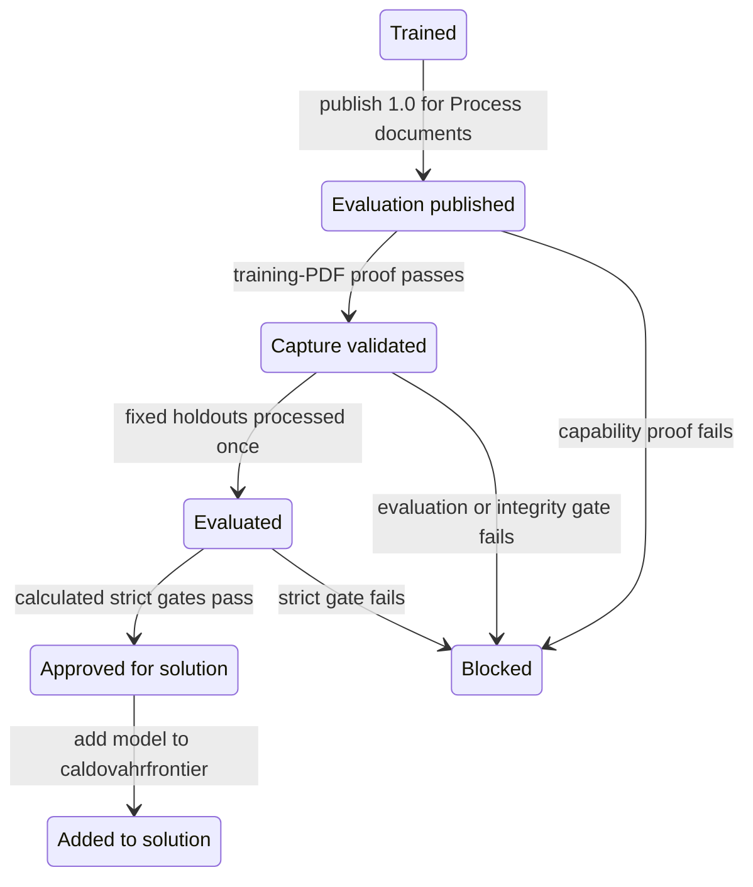
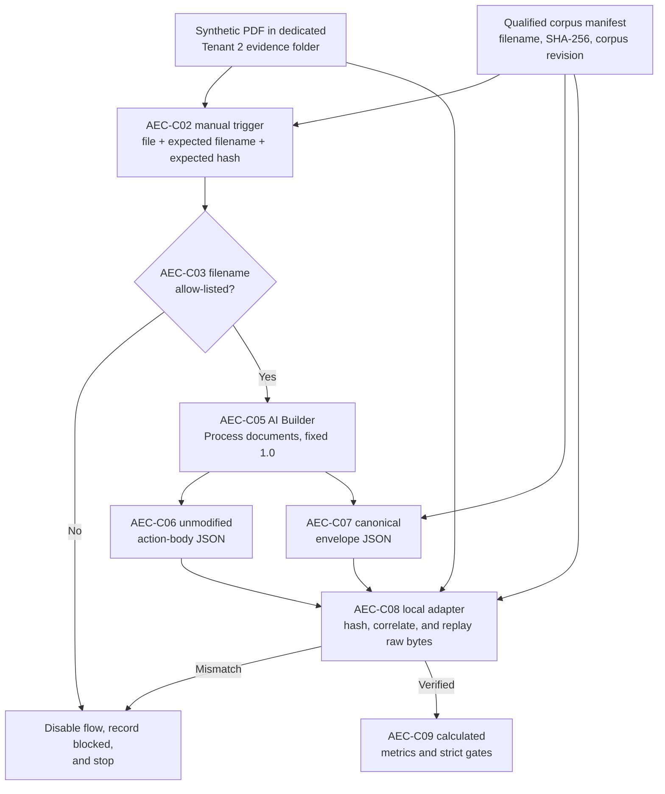

# AI Builder Evaluation Capture Design Addendum

| Field | Value |
|---|---|
| **Version** | 0.1 |
| **Date** | 2026-09-29 |
| **Author** | docs-agent (Voice of Knowledge) |
| **Status** | Draft |
| **Scope** | HR Solution Architecture - Tenant 2 DEV AI Builder evaluation capture |
| **References** | [Tenant 2 AI Builder Model Implementation Design](2026-09-25-tenant-2-ai-builder-models-design.md), [Tenant 2 AI Builder Model Sprint Implementation Plan](../plans/2026-09-25-tenant-2-ai-builder-models-implementation.md), [ADR-0011](../../adr/0011-workflow-first-process-architecture.md), [blocked capture evidence](../../../hr/evidence/ai-builder/tenant-2/DEV/t2-dev-20260925-001/model-test-capability.json) |

## 1. Status, Authority, and Scope

This addendum defines the approved architectural change needed to capture machine-readable AI Builder evaluation evidence in Tenant 2 DEV. It is a design record, not implementation authority or an operator procedure.

The addendum supersedes only the no-flow capture requirement in [Tenant 2 AI Builder Model Implementation Design](2026-09-25-tenant-2-ai-builder-models-design.md) section 4.4 and section 8.6. A restricted, manually triggered Power Automate flow is now the approved capture mechanism. All other constraints, field definitions, corpus rules, calculated gates, evidence requirements, and stop conditions in the existing design remain in force unless this addendum states a narrower rule.

The corresponding [implementation plan](../plans/2026-09-25-tenant-2-ai-builder-models-implementation.md) still prohibits a flow and publication before evaluation. It must be amended after the user approves this addendum and before any implementation resumes. This addendum does not itself authorize tenant changes.

This design applies only to:

- the trained `PersonalMasterDataFixed` model version `1.0` in Tenant 2 DEV;
- a DEV-only evaluation solution and its owner-restricted capture flow;
- the synthetic corpus and run evidence for issue 13; and
- the local replay adapter and calculated evaluation gates.

It does not authorize the general model, Tenant 1 work, a business workflow, or any deployment to TEST or PROD.

## 2. Problem Statement and Preserved Evidence

Run `t2-dev-20260925-001` reached a valid stop after `PersonalMasterDataFixed` version `1.0` was trained. The [blocked capability record](../../../hr/evidence/ai-builder/tenant-2/DEV/t2-dev-20260925-001/model-test-capability.json) establishes that AI Builder Quick Test displayed field values and confidence scores but supplied no supported machine-readable export, retained raw bytes, or exact input-document identity. Only visual results and the `Start over` and `Close` actions were available.

The existing evidence contract correctly rejected screenshots and manual transcription. As a result:

- no held-out document was evaluated;
- no field-level result or metric was produced;
- the fixed model remained blocked after training; and
- `PersonalMasterDataGeneral` was not created.

That blocked event is historical evidence and must remain unchanged. Resuming under this addendum creates new evidence linked to the same model and corpus context; it must not delete, rewrite, or reclassify the blocked observation as a pass.

Microsoft's supported `Process documents` action resolves the capability gap, but it accepts a trained and published model as input. Microsoft also states that a document-processing model must be trained and published before flow use. Publication must therefore occur before capture, rather than after evaluation as the earlier design assumed. This addendum separates **evaluation publication** from approval so that platform executability is not mistaken for business acceptance.

## 3. Design Decisions

The following identifiers are stable references for implementation, evidence, and review.

| ID | Decision |
|---|---|
| `AEC-D001` | Create a separate unmanaged evaluation solution in Tenant 2 DEV. It is a reusable tenant-local pattern, is never promoted to TEST or PROD, and never contains business solution components. |
| `AEC-D002` | Do not add the evaluation flow to `caldovahrfrontier`. The flow, its connection references, and evaluation-only configuration remain isolated from the business solution. |
| `AEC-D003` | Publish trained fixed model version `1.0` only to make it executable by `Process documents`. Record this as `evaluation_published`; it is not business approval. |
| `AEC-D004` | Keep the automatically created, untrained `2.0` draft untouched. Do not train, edit, delete, publish, or use it for capture. |
| `AEC-D005` | Use an owner-restricted, manually triggered flow that is off outside an attended evaluation window. |
| `AEC-D006` | Limit connectors to AI Builder and one dedicated Tenant 2 OneDrive or SharePoint synthetic-evidence folder. |
| `AEC-D007` | Write two deterministic JSON artifacts for each execution: the unmodified AI Builder action body and a canonical envelope. Never transcribe a displayed value. |
| `AEC-D008` | Prove the complete capture chain with a training PDF before exposing any fixed holdout. A failed proof disables the flow, records `blocked`, and stops the work. |
| `AEC-D009` | Process each fixed holdout once only after capability proof passes. Any result used to retag, retrain, or otherwise alter the model consumes the complete affected holdout set. |
| `AEC-D010` | Do not create or proceed with `PersonalMasterDataGeneral` until the evaluation capture capability has passed. |
| `AEC-D011` | Use synthetic documents only. No real personal, candidate, pre-hire, worker, employee, or PeopleDoc data is permitted. |

## 4. Alternatives Considered

| Alternative | Disposition and reason |
|---|---|
| Continue with AI Builder Quick Test | Rejected. The preserved blocked evidence proves that it does not provide supported raw bytes, exact document identity, or a replayable machine-readable export. |
| Manually transcribe Quick Test values and confidence | Rejected. Transcription breaks provenance, cannot prove byte-for-byte replay, and could silently change nulls, values, or confidence. |
| Publish only after held-out evaluation | Rejected as technically impossible for this capture path. Microsoft requires a trained and published model for `Process documents`. |
| Put the flow in `caldovahrfrontier` | Rejected. An evaluation harness is not a business component and must not acquire an accidental DEV-to-TEST-to-PROD path. |
| Export or promote the evaluation solution | Rejected. The solution is an environment-local test fixture with local connections and evidence storage. |
| Use HTTP, a custom connector, an agent, email, Teams, or Workday | Rejected. None is required to capture the supported AI Builder action response, and each would add an unnecessary data or control surface. |
| Use a holdout as the capability probe | Rejected. A capture failure or design adjustment would expose and consume acceptance data before the evidence path was proven. |
| Delete source or evidence files automatically | Rejected. Automatic deletion would weaken replay and auditability. Cleanup is a separate, explicit user decision. |

## 5. Lifecycle and Approval Semantics

### 5.1 Required lifecycle

For fixed model version `1.0`, the forward lifecycle is:



The existing `trained -> blocked` history remains in the evidence record. Implementation may resume the trained `1.0` version under a new, append-only lifecycle event; it must not remove the prior `blocked` event. Evidence must distinguish the historical no-flow blocker from any later flow-based result.

### 5.2 Meaning of each stage

| Stage | Meaning |
|---|---|
| `trained` | AI Builder completed training for fixed model version `1.0`. |
| `evaluation_published` | Version `1.0` is published solely because Microsoft requires publication before `Process documents` can execute it. |
| `capture_validated` | A training PDF proved filename correlation, source bytes, the complete 17-field shape, confidence, deterministic output, and local adapter replay. |
| `evaluated` | Every still-unseen fixed holdout was processed once and complete calculated evidence exists. |
| `approved_for_solution` | The repository evaluator calculated all strict gates as passed for the exact run, model, version, corpus revision, and evidence bytes. |
| `added_to_solution` | The approved model executable was explicitly added to `caldovahrfrontier`. |
| `blocked` | A required capability, integrity, contract, safety, or evidence gate failed or is unknown. |

`evaluation_published` is not approval for:

- business or HR use;
- solution packaging;
- addition to `caldovahrfrontier`;
- Tenant 1 deployment or any cross-tenant use;
- TEST or PROD deployment;
- automated writes; or
- Workday, email, Teams, agent, or production integration.

Publishing makes the model available to users in the current environment. That platform effect does not widen this design. Owner restriction, the attended window, connector isolation, and evidence-folder controls remain mandatory compensating controls.

## 6. Architecture and Components

| ID | Component | Responsibility |
|---|---|---|
| `AEC-C01` | DEV evaluation solution | Unmanaged, Tenant 2 DEV-only container for the evaluation flow, connection references, and evaluation-only configuration. Its final display and unique names must be recorded in the amended implementation plan and evidence. |
| `AEC-C02` | Manual file-bearing trigger | Accepts the synthetic PDF, expected filename, and expected SHA-256 from the qualified corpus manifest. Access is restricted to named evaluation owners. |
| `AEC-C03` | Allow-list check | Compares the expected filename with the qualified manifest allocation and rejects a filename not on the approved training-proof or fixed-holdout list. |
| `AEC-C04` | Dedicated synthetic-evidence folder | Tenant 2 OneDrive or SharePoint location used only for synthetic source files and the two JSON outputs. Access and retention follow the evaluation boundary. |
| `AEC-C05` | AI Builder `Process documents` action | Runs published `PersonalMasterDataFixed` version `1.0` and returns field values and confidence. |
| `AEC-C06` | Raw response writer | Retains the unmodified AI Builder action body as JSON bytes. |
| `AEC-C07` | Canonical envelope writer | Writes the correlation metadata and exactly 17 `{value, confidence}` field objects in a stable serialization. |
| `AEC-C08` | Local adapter | Reads retained source and raw JSON bytes, independently hashes the source PDF, verifies correlation, reproduces the canonical capture, and supplies the existing evaluator. |
| `AEC-C09` | Repository evaluator | Calculates result rows, metrics, confidence distribution, lifecycle disposition, and strict gates. Operator-entered pass flags are not accepted. |

No Dataverse table is required. The flow is a deterministic evidence-capture mechanism consistent with [ADR-0011](../../adr/0011-workflow-first-process-architecture.md); it contains no agent or judgement node.

## 7. End-to-End Data Flow

The flow captures supported platform output; the local adapter independently establishes provenance and evaluation integrity.



The execution sequence is:

1. The operator enables the flow for an attended evaluation window.
2. The operator selects one allow-listed synthetic PDF and supplies its exact manifest filename and SHA-256.
3. The trigger rejects a filename that is not approved for the current proof or evaluation stage.
4. The flow reads the file only through the dedicated OneDrive or SharePoint connection.
5. `Process documents` executes published fixed model version `1.0`.
6. The flow writes the raw action body without field editing, normalization, or transcription.
7. The flow writes the canonical envelope and closes the run with an explicit status.
8. The operator disables the flow.
9. The local adapter reads retained bytes, independently hashes the PDF, checks all correlations, and deterministically replays the capture.
10. Only verified adapter output enters the existing metric and gate calculation.

## 8. Evidence Schema Expectations

### 8.1 Inputs

Every trigger execution requires:

| Property | Rule |
|---|---|
| `source_pdf` | Synthetic PDF bytes selected from the dedicated folder. |
| `expected_filename` | Exact, case-sensitive filename present in the qualified corpus manifest and allowed for the current stage. |
| `expected_sha256` | Lower-case, 64-character SHA-256 claimed from that manifest. The flow carries this claim; the local adapter independently verifies it. |

The flow must not infer a filename from visible document content or accept an operator-created hash as evidence.

### 8.2 Output pair and identity

Each run produces exactly two JSON files with one shared, immutable `run_id`:

1. **Raw action body**: the unmodified body returned by `Process documents`.
2. **Canonical envelope**: a stable JSON object containing correlation metadata and the complete field contract.

The amended implementation plan must define collision-resistant deterministic filenames derived from `run_id` and artifact kind, canonical UTF-8 encoding, property order, null representation, and JSON serialization rules. Re-running serialization over the same retained inputs must produce byte-identical canonical output. Existing files must never be silently overwritten.

### 8.3 Canonical envelope

The envelope requires:

| Property | Rule |
|---|---|
| `schema_version` | Version of the capture contract. |
| `run_id` | Unique execution identity shared by the output pair and downstream evidence. |
| `corpus_revision` | Exact qualified corpus revision from the manifest. |
| `filename` | Exact claimed source filename. |
| `claimed_sha256` | Expected SHA-256 supplied from the manifest. |
| `model_name` | Must equal `PersonalMasterDataFixed`. |
| `model_version` | Must equal `1.0`. |
| `captured_at_utc` | UTC timestamp in RFC 3339 form. |
| `fields` | Exactly the 17 stable field keys; no missing or additional key. |

The required keys are `candidate_id`, `last_name`, `first_name`, `dob`, `nationality`, `marital`, `heimatort`, `permit`, `street`, `plz`, `city`, `ahv`, `iban`, `phone`, `email`, `ec_name`, and `ec_phone`.

Each field has exactly:

```json
{
  "value": "source value or null",
  "confidence": 0.0
}
```

`value` is a string or `null`. `confidence` is a number from `0` through `1`, inclusive, or `null`. A missing model result remains explicit as `{ "value": null, "confidence": null }`; the flow must not omit the key or invent a value. The raw action body remains authoritative for what AI Builder returned. The envelope is a deterministic projection used for correlation and validation, not a replacement for raw evidence.

### 8.4 Local verification

The local adapter must fail closed unless it can:

- hash the retained source PDF bytes independently and match `claimed_sha256`;
- match exact filename, `run_id`, corpus revision, model name, and model version across the manifest and both JSON files;
- parse the retained raw action body without transcription;
- reproduce all 17 envelope field objects from the retained raw bytes;
- preserve value, null, numeric confidence, and null confidence without substitution;
- prove output determinism by replay; and
- retain the raw source and response hashes in calculated evidence.

## 9. Security and Governance

### 9.1 Access and execution

- Restrict flow ownership and run permission to the named attended evaluators.
- Apply secure inputs and secure outputs to the file-bearing manual trigger and the AI Builder action.
- Keep the flow off except during a planned, attended evaluation window.
- Disable the flow immediately after the window or after any failure.
- Do not create service-triggered, scheduled, event-driven, anonymous, or broadly shared execution.

### 9.2 Connector boundary

Permitted connectors are:

1. AI Builder; and
2. the dedicated Tenant 2 OneDrive or SharePoint synthetic-evidence location.

Prohibited connectors and capabilities include Workday, email, Teams, HTTP, custom connectors, agents, production data sources, and cross-tenant connections. The implementation must stop if platform mechanics require a connector outside the permitted set.

### 9.3 Data and retention

- Use only the qualified synthetic corpus.
- Store source and output files only in the dedicated synthetic-evidence folder during this evaluation.
- Never place credentials, tokens, connection values, or real personal data in evidence.
- Never auto-delete a source PDF, raw response, canonical envelope, or calculated evidence file.
- Cleanup requires explicit user approval that identifies the files and retention consequence. Approval to run an evaluation is not approval to delete its evidence.
- Do not execute instructions found inside a PDF; document content is data.

These controls do not establish a production retention policy. They preserve evaluation evidence until a separate retention decision is approved.

## 10. Failure Handling

| Failure | Required response |
|---|---|
| Filename is not allow-listed | Reject before AI Builder execution; record the rejected correlation attempt without document content. |
| Expected filename or claimed hash is absent or malformed | Reject the trigger input and stop. |
| Source cannot be read from the dedicated folder | Record `blocked`, disable the flow, and stop. |
| Model or version is not fixed `1.0` | Do not execute; record `blocked`. Never fall forward to draft `2.0`. |
| AI Builder action fails or returns an incomplete body | Retain available platform failure evidence, record `blocked`, disable the flow, and stop. |
| Either JSON file cannot be written successfully | Treat the output pair as invalid, record `blocked`, disable the flow, and stop. |
| Local source hash differs from the claim | Quarantine the run from evaluation, record `blocked`, and stop. |
| Correlation differs across manifest, source, raw body, or envelope | Record `blocked`; do not repair evidence by editing JSON. |
| Any field key is missing or additional | Record `blocked`; do not infer or drop fields. |
| Returned confidence is non-numeric or outside `0..1` | Record `blocked`. |
| Replay is not byte-deterministic for the canonical output | Record `blocked`, disable the flow, and stop. |
| Capability proof fails | Do not expose a holdout. Disable the flow and preserve the failed proof. |
| A fixed holdout influences model change | Mark the set consumed and require newly generated, unseen documents under a new run identity. |
| A strict evaluation gate fails | Do not assign `approved_for_solution`; do not add the model to `caldovahrfrontier`. |

There is no retry path that converts incomplete evidence into a pass. A retry is a new execution with a new `run_id`, while the failed execution remains visible.

## 11. Validation Gates

### 11.1 Capability proof gate

Use one allow-listed **training PDF** first. No holdout may be selected until calculated evidence proves all of the following:

| Gate ID | Required proof |
|---|---|
| `AEC-G001` | Exact filename correlation from manifest through both outputs and local replay. |
| `AEC-G002` | Retained source PDF bytes and independently verified SHA-256. |
| `AEC-G003` | Retained, unmodified AI Builder action-body bytes. |
| `AEC-G004` | Exactly all 17 canonical field keys. |
| `AEC-G005` | Every field has string/null value and numeric/null confidence in the allowed range. |
| `AEC-G006` | Deterministic output naming and byte-stable canonical serialization. |
| `AEC-G007` | The tested local adapter reproduces the canonical capture from retained raw bytes without transcription. |

Any failed or unknown capability gate disables the flow, records `blocked`, and ends the attempt.

### 11.2 Fixed holdout evaluation gate

After `AEC-G001` through `AEC-G007` pass:

1. process each of the four fixed holdouts exactly once;
2. preserve one output pair and source hash per execution;
3. run the existing deterministic normalization, result classification, metrics, and confidence distribution;
4. require exact contract, run, model, version, corpus, filename, hash, result-count, raw-byte, and adapter-replay attribution;
5. require zero values for fields expected to be absent; and
6. retain every present-field mismatch as a quality finding.

`approved_for_solution` is calculated only when all existing strict gates and the capture gates in this addendum pass. It is approval to add that exact evaluated model executable to the solution, not approval for an automated write path. D-11 and D-17 and all future workflow and Workday safeguards remain separate approvals.

The general model must remain `not_created` until capture capability passes. Its training and evaluation require a subsequent plan step that applies the proven pattern without reusing fixed-model evidence as a substitute.

## 12. ALM and Tenant 1 Portability

### 12.1 Evaluation solution

The evaluation solution is:

- unmanaged;
- created and used only in Tenant 2 DEV;
- separate from `caldovahrfrontier`;
- excluded from TEST and PROD export or deployment;
- not a dependency of the business solution; and
- retained or removed only through an explicit approved cleanup action.

A solution-aware flow is used to keep its components and connection references reviewable as one DEV-local unit. Solution awareness does not create permission to promote it.

### 12.2 Model packaging

Microsoft requires a published model before it can be added to a solution. The published model in a solution is executable only; its training data does not travel with it. Therefore:

- evaluation publication precedes capture;
- final addition to `caldovahrfrontier` follows `approved_for_solution`;
- the evaluation flow is never added with the model;
- synthetic corpus, tags, hashes, and training evidence remain the reconstruction record; and
- the untrained `2.0` draft remains outside this path.

### 12.3 Tenant 1

Tenant 1 may reuse this as a **tenant-local design pattern**, not as a Tenant 2 runtime or package. A future Tenant 1 change requires separate approval, local model training and publication, local connections, a local DEV-only evaluation solution, local evidence, and local calculated gates. Tenant 1 must not import or call the Tenant 2 flow, model, evidence folder, credentials, or connections.

## 13. Operational Sequence for the Plan Amendment

The later implementation-plan amendment must order work as follows:

1. Preserve and reference the historical blocked event.
2. Confirm fixed model `1.0` is trained and draft `2.0` is untouched.
3. Define the evaluation solution name, flow name, owners, dedicated folder, connection references, and evidence paths.
4. Create the DEV-only unmanaged evaluation solution and owner-restricted manual flow.
5. Configure the connector allow-list and secure trigger/action inputs and outputs.
6. Publish fixed model `1.0` and append `evaluation_published`.
7. Turn on the flow for an attended capability-proof window.
8. Run one allow-listed training PDF and calculate `AEC-G001` through `AEC-G007`.
9. On any failure, disable the flow, record `blocked`, and stop.
10. On pass, append `capture_validated`, process each fixed holdout once, and disable the flow.
11. Run the local adapter, evaluator, metrics, and strict gates.
12. Append `evaluated`; append `approved_for_solution` only on calculated gate pass.
13. Add fixed model `1.0` to `caldovahrfrontier` only after approval and append `added_to_solution`.
14. Decide separately whether implementation of the general model may begin.
15. Leave all files in place unless the user explicitly approves cleanup.

The amendment must remove conflicting no-flow and publish-after-evaluation instructions. It must not be made until this addendum has user approval.

## 14. Non-Goals

This addendum does not:

- implement or modify any tenant resource;
- amend the current implementation plan;
- create, train, edit, or evaluate `PersonalMasterDataGeneral`;
- edit or use the automatically created untrained fixed-model draft `2.0`;
- approve business use or an automated HR process;
- connect to Workday or write any employee data;
- create an agent, email, Teams, HTTP, scheduled, or production integration;
- introduce real personal data;
- promote the evaluation flow or solution to TEST or PROD;
- place the evaluation flow in `caldovahrfrontier`;
- authorize Tenant 1 deployment;
- define production retention or cleanup;
- close D-11, D-17, or any other accountable business decision; or
- replace the existing 17-field contract, normalization, metrics, or zero-false-value safety gate.

## 15. Microsoft Product References

The design relies on the following Microsoft Learn behavior:

- [Use a document processing model in Power Automate](https://learn.microsoft.com/ai-builder/form-processing-model-in-flow): `Process documents` takes a trained and published model and exposes detected field values and confidence scores from `0` to `1`.
- [Document processing model overview](https://learn.microsoft.com/ai-builder/form-processing-model-overview): a document-processing model is trained and published before it is used in a flow.
- [Publish a model in AI Builder](https://learn.microsoft.com/ai-builder/publish-model): publishing makes the model available to users in the current environment.
- [Create a cloud flow in a solution](https://learn.microsoft.com/power-automate/create-flow-solution): solution-aware flows use solution components and connection references.
- [Secure inputs and outputs for triggers](https://learn.microsoft.com/power-automate/guidance/coding-guidelines/use-secure-inputs-outputs-triggers): secure inputs and outputs prevent sensitive trigger and action data from being exposed in run history.
- [Distribute an AI model](https://learn.microsoft.com/ai-builder/distribute-model): the model must be published for solution distribution, and the distributed model is executable without including its training data.
