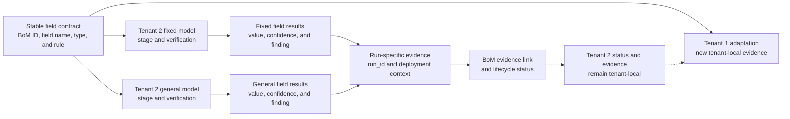

# PeopleDoc Master Data AI Builder Field BoM

| Field | Value |
|---|---|
| **Version** | 0.5 |
| **Date** | 2026-10-01 |
| **Author** | docs-agent (Voice of Knowledge) |
| **Status** | Draft |
| **Scope** | UC-0001 AI Builder field design, implementation and verification traceability |
| **References** | [Tenant 2 AI Builder Model Implementation Design](../../../../docs/superpowers/specs/2026-09-25-tenant-2-ai-builder-models-design.md), [AI Builder Test Inputs and Outcomes BoM](bom-0002-ai-builder-test-inputs-and-outcomes.md), [UC-0001 PRD](prd-0001-personal-master-data-completion-agent.md) |

## 1. Purpose and Authority

This repository-owned Build of Materials (BoM) traces the 17-field AI Builder contract from design through implementation and verification. It is the authoritative record for each field's model stage, verification status and implementation evidence.

The [Tenant 2 AI Builder Model Implementation Design](../../../../docs/superpowers/specs/2026-09-25-tenant-2-ai-builder-models-design.md) remains authoritative for field names, types and contract rules. This BoM does not change that contract.

This document is this package's assessment. It is not the customer-supplied UC-0001 artefact inventory, which is broader. The customer-supplied personal-master-data field workbook is referenced by the source material but is not present in this repository. PeopleDoc source labels therefore remain explicitly unverified rather than being inferred.

### 1.1 Traceability overview

Each BoM row connects one stable field contract to the two independently trained models. A status advances only from run-specific evidence, and Tenant 2 evidence never proves Tenant 1 implementation.



## 2. Controlled Statuses

### 2.1 Design status

| Status | Meaning |
|---|---|
| `Draft` | The field is specified in a draft design but is not yet approved |
| `Approved` | The field contract has received the required design approval |
| `Superseded` | The row is retained for history but a later BoM row replaces it |

### 2.2 Model stage

Model stages follow this sequence:

```text
Not started
  -> Created
  -> Schema defined
  -> Tagged
  -> Trained
  -> Evaluation published
  -> Capture validated
  -> Evaluated
  -> Approved for solution
  -> Added to solution
```

`Blocked` may replace the next expected stage when evidence records a readiness, corpus, contract, training, safety, publication or solution-add failure. A stage advances only when the required evidence exists.

`Capture validated` for the fixed model records only that the retained training-proof capture can be reproduced deterministically with the exact contract. It is not held-out evaluation, model-quality evidence, business-use approval or solution membership. Historical blocked evidence remains authoritative for the attempts it records.

`Evaluated` records a completed strict evaluation against the approved held-out set. It does not mean `Approved for solution`, and Task 10 remains the separate approval gate.

### 2.3 Verification status

| Status | Meaning |
|---|---|
| `Not evaluated` | No complete field-level evaluation evidence exists |
| `Evaluated - no findings` | Complete evidence contains no extraction-quality or safety finding for the field |
| `Evaluated - quality findings` | Complete evidence contains one or more missing or incorrect present-field values |
| `Blocked - safety failure` | The model returned a value where the field was expected to be absent |
| `Evidence incomplete` | A result is claimed but cannot be traced to complete field-level evidence |

An evaluated field is not thereby approved for a future automated write path. That approval remains outside this implementation and depends on the decisions and safeguards identified in the model design.

## 3. Field Lifecycle Evidence

### 3.1 Prior capture-gate matrix

The fixed-model columns in this matrix retain the stage reached before held-out evaluation. Section 3.2 is the authoritative current fixed-model disposition.

| BoM ID | Contract field | PeopleDoc source label | AI Builder type | Designed contract | Design reference | Design status | Prior fixed-model stage | Prior fixed verification | Tenant 2 general-model stage | Tenant 2 general verification | Evidence |
|---|---|---|---|---|---|---|---|---|---|---|---|
| `BOM-0001-F01` | `candidate_id` | Unverified - customer-supplied field workbook unavailable | Text | Preserve the identifier as text | [Design Section 5.3](../../../../docs/superpowers/specs/2026-09-25-tenant-2-ai-builder-models-design.md#53-common-field-contract) | `Draft` | `Capture validated` | `Evidence incomplete` | `Not started` | `Not evaluated` | [Fixed schema](../../../../hr/evidence/ai-builder/tenant-2/DEV/t2-dev-20260925-001/model-schema-fixed.json); [evaluation publication](../../../../hr/evidence/ai-builder/tenant-2/DEV/t2-dev-20260925-001/model-evaluation-publication.json); [blocked test capability](../../../../hr/evidence/ai-builder/tenant-2/DEV/t2-dev-20260925-001/model-test-capability.json); [blocked training-capture attempt](../../../../hr/evidence/ai-builder/tenant-2/DEV/t2-dev-20260925-001/training-capture-attempt.json); [capture capability](../../../../hr/evidence/ai-builder/tenant-2/DEV/t2-dev-20260925-001/capture-capability.json) |
| `BOM-0001-F02` | `last_name` | Unverified - customer-supplied field workbook unavailable | Text | Preserve Unicode characters | [Design Section 5.3](../../../../docs/superpowers/specs/2026-09-25-tenant-2-ai-builder-models-design.md#53-common-field-contract) | `Draft` | `Capture validated` | `Evidence incomplete` | `Not started` | `Not evaluated` | [Fixed schema](../../../../hr/evidence/ai-builder/tenant-2/DEV/t2-dev-20260925-001/model-schema-fixed.json); [evaluation publication](../../../../hr/evidence/ai-builder/tenant-2/DEV/t2-dev-20260925-001/model-evaluation-publication.json); [blocked test capability](../../../../hr/evidence/ai-builder/tenant-2/DEV/t2-dev-20260925-001/model-test-capability.json); [blocked training-capture attempt](../../../../hr/evidence/ai-builder/tenant-2/DEV/t2-dev-20260925-001/training-capture-attempt.json); [capture capability](../../../../hr/evidence/ai-builder/tenant-2/DEV/t2-dev-20260925-001/capture-capability.json) |
| `BOM-0001-F03` | `first_name` | Unverified - customer-supplied field workbook unavailable | Text | Preserve Unicode characters | [Design Section 5.3](../../../../docs/superpowers/specs/2026-09-25-tenant-2-ai-builder-models-design.md#53-common-field-contract) | `Draft` | `Capture validated` | `Evidence incomplete` | `Not started` | `Not evaluated` | [Fixed schema](../../../../hr/evidence/ai-builder/tenant-2/DEV/t2-dev-20260925-001/model-schema-fixed.json); [evaluation publication](../../../../hr/evidence/ai-builder/tenant-2/DEV/t2-dev-20260925-001/model-evaluation-publication.json); [blocked test capability](../../../../hr/evidence/ai-builder/tenant-2/DEV/t2-dev-20260925-001/model-test-capability.json); [blocked training-capture attempt](../../../../hr/evidence/ai-builder/tenant-2/DEV/t2-dev-20260925-001/training-capture-attempt.json); [capture capability](../../../../hr/evidence/ai-builder/tenant-2/DEV/t2-dev-20260925-001/capture-capability.json) |
| `BOM-0001-F04` | `dob` | Unverified - customer-supplied field workbook unavailable | Date | Source format is `DD.MM.YYYY`; canonical comparison is `YYYY-MM-DD` | [Design Section 5.3](../../../../docs/superpowers/specs/2026-09-25-tenant-2-ai-builder-models-design.md#53-common-field-contract) | `Draft` | `Capture validated` | `Evidence incomplete` | `Not started` | `Not evaluated` | [Fixed schema](../../../../hr/evidence/ai-builder/tenant-2/DEV/t2-dev-20260925-001/model-schema-fixed.json); [evaluation publication](../../../../hr/evidence/ai-builder/tenant-2/DEV/t2-dev-20260925-001/model-evaluation-publication.json); [blocked test capability](../../../../hr/evidence/ai-builder/tenant-2/DEV/t2-dev-20260925-001/model-test-capability.json); [blocked training-capture attempt](../../../../hr/evidence/ai-builder/tenant-2/DEV/t2-dev-20260925-001/training-capture-attempt.json); [capture capability](../../../../hr/evidence/ai-builder/tenant-2/DEV/t2-dev-20260925-001/capture-capability.json) |
| `BOM-0001-F05` | `nationality` | Unverified - customer-supplied field workbook unavailable | Text | No vocabulary substitution in this increment | [Design Section 5.3](../../../../docs/superpowers/specs/2026-09-25-tenant-2-ai-builder-models-design.md#53-common-field-contract) | `Draft` | `Capture validated` | `Evidence incomplete` | `Not started` | `Not evaluated` | [Fixed schema](../../../../hr/evidence/ai-builder/tenant-2/DEV/t2-dev-20260925-001/model-schema-fixed.json); [evaluation publication](../../../../hr/evidence/ai-builder/tenant-2/DEV/t2-dev-20260925-001/model-evaluation-publication.json); [blocked test capability](../../../../hr/evidence/ai-builder/tenant-2/DEV/t2-dev-20260925-001/model-test-capability.json); [blocked training-capture attempt](../../../../hr/evidence/ai-builder/tenant-2/DEV/t2-dev-20260925-001/training-capture-attempt.json); [capture capability](../../../../hr/evidence/ai-builder/tenant-2/DEV/t2-dev-20260925-001/capture-capability.json) |
| `BOM-0001-F06` | `marital` | Unverified - customer-supplied field workbook unavailable | Text | No vocabulary substitution in this increment | [Design Section 5.3](../../../../docs/superpowers/specs/2026-09-25-tenant-2-ai-builder-models-design.md#53-common-field-contract) | `Draft` | `Capture validated` | `Evidence incomplete` | `Not started` | `Not evaluated` | [Fixed schema](../../../../hr/evidence/ai-builder/tenant-2/DEV/t2-dev-20260925-001/model-schema-fixed.json); [evaluation publication](../../../../hr/evidence/ai-builder/tenant-2/DEV/t2-dev-20260925-001/model-evaluation-publication.json); [blocked test capability](../../../../hr/evidence/ai-builder/tenant-2/DEV/t2-dev-20260925-001/model-test-capability.json); [blocked training-capture attempt](../../../../hr/evidence/ai-builder/tenant-2/DEV/t2-dev-20260925-001/training-capture-attempt.json); [capture capability](../../../../hr/evidence/ai-builder/tenant-2/DEV/t2-dev-20260925-001/capture-capability.json) |
| `BOM-0001-F07` | `heimatort` | Unverified - customer-supplied field workbook unavailable | Text | Preserve an explicit em dash as a literal value | [Design Section 5.3](../../../../docs/superpowers/specs/2026-09-25-tenant-2-ai-builder-models-design.md#53-common-field-contract) | `Draft` | `Capture validated` | `Evidence incomplete` | `Not started` | `Not evaluated` | [Fixed schema](../../../../hr/evidence/ai-builder/tenant-2/DEV/t2-dev-20260925-001/model-schema-fixed.json); [evaluation publication](../../../../hr/evidence/ai-builder/tenant-2/DEV/t2-dev-20260925-001/model-evaluation-publication.json); [blocked test capability](../../../../hr/evidence/ai-builder/tenant-2/DEV/t2-dev-20260925-001/model-test-capability.json); [blocked training-capture attempt](../../../../hr/evidence/ai-builder/tenant-2/DEV/t2-dev-20260925-001/training-capture-attempt.json); [capture capability](../../../../hr/evidence/ai-builder/tenant-2/DEV/t2-dev-20260925-001/capture-capability.json) |
| `BOM-0001-F08` | `permit` | Unverified - customer-supplied field workbook unavailable | Text | Preserve an explicit em dash as a literal value | [Design Section 5.3](../../../../docs/superpowers/specs/2026-09-25-tenant-2-ai-builder-models-design.md#53-common-field-contract) | `Draft` | `Capture validated` | `Evidence incomplete` | `Not started` | `Not evaluated` | [Fixed schema](../../../../hr/evidence/ai-builder/tenant-2/DEV/t2-dev-20260925-001/model-schema-fixed.json); [evaluation publication](../../../../hr/evidence/ai-builder/tenant-2/DEV/t2-dev-20260925-001/model-evaluation-publication.json); [blocked test capability](../../../../hr/evidence/ai-builder/tenant-2/DEV/t2-dev-20260925-001/model-test-capability.json); [blocked training-capture attempt](../../../../hr/evidence/ai-builder/tenant-2/DEV/t2-dev-20260925-001/training-capture-attempt.json); [capture capability](../../../../hr/evidence/ai-builder/tenant-2/DEV/t2-dev-20260925-001/capture-capability.json) |
| `BOM-0001-F09` | `street` | Unverified - customer-supplied field workbook unavailable | Text | Preserve punctuation | [Design Section 5.3](../../../../docs/superpowers/specs/2026-09-25-tenant-2-ai-builder-models-design.md#53-common-field-contract) | `Draft` | `Capture validated` | `Evidence incomplete` | `Not started` | `Not evaluated` | [Fixed schema](../../../../hr/evidence/ai-builder/tenant-2/DEV/t2-dev-20260925-001/model-schema-fixed.json); [evaluation publication](../../../../hr/evidence/ai-builder/tenant-2/DEV/t2-dev-20260925-001/model-evaluation-publication.json); [blocked test capability](../../../../hr/evidence/ai-builder/tenant-2/DEV/t2-dev-20260925-001/model-test-capability.json); [blocked training-capture attempt](../../../../hr/evidence/ai-builder/tenant-2/DEV/t2-dev-20260925-001/training-capture-attempt.json); [capture capability](../../../../hr/evidence/ai-builder/tenant-2/DEV/t2-dev-20260925-001/capture-capability.json) |
| `BOM-0001-F10` | `plz` | Unverified - customer-supplied field workbook unavailable | Text | Never define as Number; leading zeros must survive | [Design Section 5.3](../../../../docs/superpowers/specs/2026-09-25-tenant-2-ai-builder-models-design.md#53-common-field-contract) | `Draft` | `Capture validated` | `Evidence incomplete` | `Not started` | `Not evaluated` | [Fixed schema](../../../../hr/evidence/ai-builder/tenant-2/DEV/t2-dev-20260925-001/model-schema-fixed.json); [evaluation publication](../../../../hr/evidence/ai-builder/tenant-2/DEV/t2-dev-20260925-001/model-evaluation-publication.json); [blocked test capability](../../../../hr/evidence/ai-builder/tenant-2/DEV/t2-dev-20260925-001/model-test-capability.json); [blocked training-capture attempt](../../../../hr/evidence/ai-builder/tenant-2/DEV/t2-dev-20260925-001/training-capture-attempt.json); [capture capability](../../../../hr/evidence/ai-builder/tenant-2/DEV/t2-dev-20260925-001/capture-capability.json) |
| `BOM-0001-F11` | `city` | Unverified - customer-supplied field workbook unavailable | Text | Preserve Unicode characters | [Design Section 5.3](../../../../docs/superpowers/specs/2026-09-25-tenant-2-ai-builder-models-design.md#53-common-field-contract) | `Draft` | `Capture validated` | `Evidence incomplete` | `Not started` | `Not evaluated` | [Fixed schema](../../../../hr/evidence/ai-builder/tenant-2/DEV/t2-dev-20260925-001/model-schema-fixed.json); [evaluation publication](../../../../hr/evidence/ai-builder/tenant-2/DEV/t2-dev-20260925-001/model-evaluation-publication.json); [blocked test capability](../../../../hr/evidence/ai-builder/tenant-2/DEV/t2-dev-20260925-001/model-test-capability.json); [blocked training-capture attempt](../../../../hr/evidence/ai-builder/tenant-2/DEV/t2-dev-20260925-001/training-capture-attempt.json); [capture capability](../../../../hr/evidence/ai-builder/tenant-2/DEV/t2-dev-20260925-001/capture-capability.json) |
| `BOM-0001-F12` | `ahv` | Unverified - customer-supplied field workbook unavailable | Text | Never define as Number; preserve separators | [Design Section 5.3](../../../../docs/superpowers/specs/2026-09-25-tenant-2-ai-builder-models-design.md#53-common-field-contract) | `Draft` | `Capture validated` | `Evidence incomplete` | `Not started` | `Not evaluated` | [Fixed schema](../../../../hr/evidence/ai-builder/tenant-2/DEV/t2-dev-20260925-001/model-schema-fixed.json); [evaluation publication](../../../../hr/evidence/ai-builder/tenant-2/DEV/t2-dev-20260925-001/model-evaluation-publication.json); [blocked test capability](../../../../hr/evidence/ai-builder/tenant-2/DEV/t2-dev-20260925-001/model-test-capability.json); [blocked training-capture attempt](../../../../hr/evidence/ai-builder/tenant-2/DEV/t2-dev-20260925-001/training-capture-attempt.json); [capture capability](../../../../hr/evidence/ai-builder/tenant-2/DEV/t2-dev-20260925-001/capture-capability.json) |
| `BOM-0001-F13` | `iban` | Unverified - customer-supplied field workbook unavailable | Text | Preserve the extracted value and separators | [Design Section 5.3](../../../../docs/superpowers/specs/2026-09-25-tenant-2-ai-builder-models-design.md#53-common-field-contract) | `Draft` | `Capture validated` | `Evidence incomplete` | `Not started` | `Not evaluated` | [Fixed schema](../../../../hr/evidence/ai-builder/tenant-2/DEV/t2-dev-20260925-001/model-schema-fixed.json); [evaluation publication](../../../../hr/evidence/ai-builder/tenant-2/DEV/t2-dev-20260925-001/model-evaluation-publication.json); [blocked test capability](../../../../hr/evidence/ai-builder/tenant-2/DEV/t2-dev-20260925-001/model-test-capability.json); [blocked training-capture attempt](../../../../hr/evidence/ai-builder/tenant-2/DEV/t2-dev-20260925-001/training-capture-attempt.json); [capture capability](../../../../hr/evidence/ai-builder/tenant-2/DEV/t2-dev-20260925-001/capture-capability.json) |
| `BOM-0001-F14` | `phone` | Unverified - customer-supplied field workbook unavailable | Text | Preserve the extracted value and separators | [Design Section 5.3](../../../../docs/superpowers/specs/2026-09-25-tenant-2-ai-builder-models-design.md#53-common-field-contract) | `Draft` | `Capture validated` | `Evidence incomplete` | `Not started` | `Not evaluated` | [Fixed schema](../../../../hr/evidence/ai-builder/tenant-2/DEV/t2-dev-20260925-001/model-schema-fixed.json); [evaluation publication](../../../../hr/evidence/ai-builder/tenant-2/DEV/t2-dev-20260925-001/model-evaluation-publication.json); [blocked test capability](../../../../hr/evidence/ai-builder/tenant-2/DEV/t2-dev-20260925-001/model-test-capability.json); [blocked training-capture attempt](../../../../hr/evidence/ai-builder/tenant-2/DEV/t2-dev-20260925-001/training-capture-attempt.json); [capture capability](../../../../hr/evidence/ai-builder/tenant-2/DEV/t2-dev-20260925-001/capture-capability.json) |
| `BOM-0001-F15` | `email` | Unverified - customer-supplied field workbook unavailable | Text | Compare case-sensitively after normalization | [Design Section 5.3](../../../../docs/superpowers/specs/2026-09-25-tenant-2-ai-builder-models-design.md#53-common-field-contract) | `Draft` | `Capture validated` | `Evidence incomplete` | `Not started` | `Not evaluated` | [Fixed schema](../../../../hr/evidence/ai-builder/tenant-2/DEV/t2-dev-20260925-001/model-schema-fixed.json); [evaluation publication](../../../../hr/evidence/ai-builder/tenant-2/DEV/t2-dev-20260925-001/model-evaluation-publication.json); [blocked test capability](../../../../hr/evidence/ai-builder/tenant-2/DEV/t2-dev-20260925-001/model-test-capability.json); [blocked training-capture attempt](../../../../hr/evidence/ai-builder/tenant-2/DEV/t2-dev-20260925-001/training-capture-attempt.json); [capture capability](../../../../hr/evidence/ai-builder/tenant-2/DEV/t2-dev-20260925-001/capture-capability.json) |
| `BOM-0001-F16` | `ec_name` | Unverified - customer-supplied field workbook unavailable | Text | Preserve Unicode characters | [Design Section 5.3](../../../../docs/superpowers/specs/2026-09-25-tenant-2-ai-builder-models-design.md#53-common-field-contract) | `Draft` | `Capture validated` | `Evidence incomplete` | `Not started` | `Not evaluated` | [Fixed schema](../../../../hr/evidence/ai-builder/tenant-2/DEV/t2-dev-20260925-001/model-schema-fixed.json); [evaluation publication](../../../../hr/evidence/ai-builder/tenant-2/DEV/t2-dev-20260925-001/model-evaluation-publication.json); [blocked test capability](../../../../hr/evidence/ai-builder/tenant-2/DEV/t2-dev-20260925-001/model-test-capability.json); [blocked training-capture attempt](../../../../hr/evidence/ai-builder/tenant-2/DEV/t2-dev-20260925-001/training-capture-attempt.json); [capture capability](../../../../hr/evidence/ai-builder/tenant-2/DEV/t2-dev-20260925-001/capture-capability.json) |
| `BOM-0001-F17` | `ec_phone` | Unverified - customer-supplied field workbook unavailable | Text | Preserve the extracted value and separators | [Design Section 5.3](../../../../docs/superpowers/specs/2026-09-25-tenant-2-ai-builder-models-design.md#53-common-field-contract) | `Draft` | `Capture validated` | `Evidence incomplete` | `Not started` | `Not evaluated` | [Fixed schema](../../../../hr/evidence/ai-builder/tenant-2/DEV/t2-dev-20260925-001/model-schema-fixed.json); [evaluation publication](../../../../hr/evidence/ai-builder/tenant-2/DEV/t2-dev-20260925-001/model-evaluation-publication.json); [blocked test capability](../../../../hr/evidence/ai-builder/tenant-2/DEV/t2-dev-20260925-001/model-test-capability.json); [blocked training-capture attempt](../../../../hr/evidence/ai-builder/tenant-2/DEV/t2-dev-20260925-001/training-capture-attempt.json); [capture capability](../../../../hr/evidence/ai-builder/tenant-2/DEV/t2-dev-20260925-001/capture-capability.json) |

### 3.2 Current fixed-model disposition

| Current stage and verification | Fields |
|---|---|
| `Added to solution` / `Evaluated - quality findings` | `last_name`, `dob` |
| `Added to solution` / `Evaluated - no findings` | `candidate_id`, `first_name`, `nationality`, `marital`, `heimatort`, `permit`, `street`, `plz`, `city`, `ahv`, `iban`, `phone`, `email`, `ec_name`, `ec_phone` |

`PersonalMasterDataFixed` version `1.0` completed strict held-out evaluation, passed calculated solution eligibility, received attended approval, and was added as the only component in the unmanaged Tenant 2 DEV `caldovahrfrontier` solution. Exactly four approved held-outs were processed once, producing 68 field records. The calculated result contains six quality findings: four `dob` findings classified as `missing` or `invalid_format`, and two `last_name` findings classified as `incorrect`. All other fields were evaluated with no findings, and no false value was returned. The retained [validation results](../../../../hr/evidence/ai-builder/tenant-2/DEV/t2-dev-20260925-001/validation-results.json), [evaluation metrics](../../../../hr/evidence/ai-builder/tenant-2/DEV/t2-dev-20260925-001/evaluation-metrics.json), [approval eligibility](../../../../hr/evidence/ai-builder/tenant-2/DEV/t2-dev-20260925-001/fixed-approval-eligibility.json), [retained-only eligibility reverification](../../../../hr/evidence/ai-builder/tenant-2/DEV/t2-dev-20260925-001/fixed-approval-eligibility-reverification.json), [attended approval](../../../../hr/evidence/ai-builder/tenant-2/DEV/t2-dev-20260925-001/fixed-solution-approval.json), and [solution-addition evidence](../../../../hr/evidence/ai-builder/tenant-2/DEV/t2-dev-20260925-001/fixed-solution-addition.json) are this package's calculated and observed assessment, not a Caldova statement. The evaluation flow is Off. The separate unpublished draft was not edited, saved, trained, published, or discarded. No automated-write approval was granted, and `PersonalMasterDataGeneral` remains uncreated pending its separate Task 11 approval.

## 4. Evidence Rules

An implementation or verification status must link to an evidence run. Its `run-manifest.json` identifies:

- `run_id`;
- `tenant_key`, `power_platform_environment_id` and `environment_stage`;
- solution and model identities and versions;
- the held-out documents and their hashes;
- the field-level expected and actual values;
- the applicable quality and safety result.

Field-level result records reference this deployment context through `run_id`; they do not repeat or hard-code tenant and environment values. Missing evidence is recorded as missing evidence. It must not be represented as an implemented, evaluated or passing result.

The [AI Builder Test Inputs and Outcomes BoM](bom-0002-ai-builder-test-inputs-and-outcomes.md) summarizes the qualified inputs, metrics, findings, and evidence for each model execution.

Task 6 has one immutable [training-proof capture](../../../../hr/evidence/ai-builder/tenant-2/DEV/t2-dev-20260925-001/training-capture-remediation.json) and [capture pair](../../../../hr/evidence/ai-builder/tenant-2/DEV/t2-dev-20260925-001/capture/cap-20260930094537354Z-34bf8987/capture-pair.json). Tasks 7-9 used retained bytes for deterministic replay and strict held-out evaluation. Task 10 advanced the exact evaluated fixed version through `Approved for solution` to `Added to solution`. The Section 3.2 disposition therefore records `Added to solution` for all 17 fields while preserving their independent evaluation findings. This does not authorize an automated write path.

## 5. Tenant 1 Adaptation

Tenant 1 reuses the BoM IDs, field names, types, contract rules and status definitions. It does not reuse Tenant 2 model stages, model versions, run IDs, verification results or evidence.

A separately approved Tenant 1 implementation adds tenant-local status and evidence without overwriting the Tenant 2 record. Tenant 1 models are created, trained, evaluated and published locally; Tenant 2 completion is not evidence of Tenant 1 completion.

## 6. Maintenance Rules

1. BoM IDs are allocated once and never reused.
2. A contract change updates the model design and this BoM in the same change.
3. A model stage advances only after its evidence is available.
4. Verification status reflects complete field-level results, not screenshots or operator recollection.
5. Present-field extraction mismatches remain quality findings.
6. A value returned for an expected-absent field is a blocking safety failure.
7. Superseded rows remain in the BoM for historical traceability.
