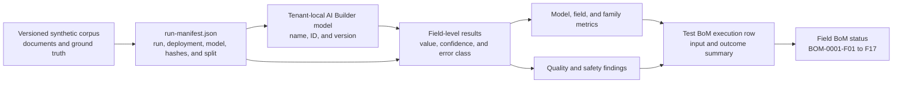

# AI Builder Test Inputs and Outcomes BoM

| Field | Value |
|---|---|
| **Version** | 0.1 |
| **Date** | 2026-09-25 |
| **Author** | docs-agent (Voice of Knowledge) |
| **Status** | Draft |
| **Scope** | UC-0001 AI Builder test-run input and outcome traceability |
| **References** | [Tenant 2 AI Builder Model Implementation Design](../../../../docs/superpowers/specs/2026-09-25-tenant-2-ai-builder-models-design.md), [PeopleDoc Master Data AI Builder Field BoM](bom-0001-peopledoc-master-data-ai-builder-fields.md), [UC-0001 PRD](prd-0001-personal-master-data-completion-agent.md) |

## 1. Purpose and Authority

This repository-owned Build of Materials (BoM) summarizes the inputs and outcomes of every AI Builder model evaluation. It is the authoritative run-level index for planned and completed tests across tenants and environments.

The [PeopleDoc Master Data AI Builder Field BoM](bom-0001-peopledoc-master-data-ai-builder-fields.md) remains authoritative for the 17-field contract lifecycle. The run manifest and machine-readable result files remain authoritative for deployment context, document identity, field-level expected and actual values, confidence, and error classification. This BoM summarizes and links that evidence; it does not duplicate or replace it.

No AI Builder model has been created, trained, or evaluated. Every current outcome is therefore recorded as `Not run - no evidence`. A blank metric is not treated as zero, and an absent result is not treated as a pass.

## 2. Traceability Model

Every outcome must resolve back to immutable input evidence and forward to the applicable field lifecycle status.



## 3. Record Grain and Identifiers

One execution row represents one model version evaluated within one evidence run. The fixed and general models may share a `run_id`, but they retain separate execution rows, results, metrics, findings, and statuses.

| Identifier | Purpose |
|---|---|
| Test BoM ID | Stable row identifier allocated once and never reused |
| `run_id` | Resolves to deployment and input context in `run-manifest.json` |
| `model_name` and `model_version` | Identify the executable evaluated in that run |
| Document hash | Identifies each exact training or held-out input |
| Field BoM ID | Maps every `field_name` result to `BOM-0001-F01` through `BOM-0001-F17` |

The composite evidence identity is `run_id` + `model_name` + `model_version`. Tenant and environment values remain in the run manifest rather than being hard-coded into this portable BoM.

## 4. Controlled Statuses

### 4.1 Input status

| Status | Meaning |
|---|---|
| `Planned` | Allocation is designed, but document hashes and corpus qualification are not complete |
| `Qualified` | Corpus integrity, ground truth, field coverage, hashes, and split integrity pass |
| `Executed` | The qualified inputs were processed by the identified model version |
| `Blocked` | A readiness, corpus, contract, or input-integrity failure prevents execution |

### 4.2 Outcome status

| Status | Meaning |
|---|---|
| `Not run - no evidence` | No complete model result exists |
| `Evaluated - no findings` | Complete metrics exist, the false-value rate is zero, and no present-field extraction finding exists |
| `Evaluated - quality findings` | Complete metrics exist, the false-value rate is zero, and one or more present-field extraction findings exist |
| `Blocked - strict gate failure` | Corpus, contract, attribution, or zero-false-value safety gate failed |
| `Technically complete` | The evaluated model is published, added to the solution, and has complete evidence |
| `Evidence incomplete` | An outcome is claimed but cannot be resolved to the required evidence |

An outcome status never grants approval for a future automated write path.

## 5. Planned Input Inventory

Both models use the same contract fields, `BOM-0001-F01` through `BOM-0001-F17`, but have independent document allocations.

### 5.1 Model-level allocation

| Test BoM ID | Model | Input groups | Training allocation | Initial held-out allocation | Planned documents | Ground truth | Current input status |
|---|---|---|---|---|---:|---|---|
| `BOM-0002-R01` | `PersonalMasterDataFixed` | Four layout collections | Documents 01-05 in each collection | Document 06 in each collection | 24 | Package CSV and JSON | `Planned` |
| `BOM-0002-R02` | `PersonalMasterDataGeneral` | Eight document families | First two documents in each family | Third document in each family | 24 | Package CSV and JSON | `Planned` |

Document hashes, corpus revision, generator revision, and the final split are not assigned until `run-manifest.json` is created and corpus qualification passes.

### 5.2 Fixed-template collections

| Collection | Planned training documents | Planned held-out documents | Planned field results |
|---|---:|---:|---:|
| `Personalblatt` | 5 | 1 | 17 |
| `AnmeldungGemeinde` | 5 | 1 | 17 |
| `Sozialversicherung` | 5 | 1 | 17 |
| `Bankverbindung` | 5 | 1 | 17 |
| **Total** | **20** | **4** | **68** |

### 5.3 General-document families

| Family | Planned training documents | Planned held-out documents | Planned field results |
|---|---:|---:|---:|
| `arbeitsvertrag` | 2 | 1 | 17 |
| `anschreiben` | 2 | 1 | 17 |
| `bewilligung` | 2 | 1 | 17 |
| `versicherung` | 2 | 1 | 17 |
| `zivilstand` | 2 | 1 | 17 |
| `selbstdeklaration` | 2 | 1 | 17 |
| `scan-degraded` | 2 | 1 | 17 |
| `new-joiner-sheet` | 2 | 1 | 17 |
| **Total** | **16** | **8** | **136** |

Planned field-result counts are the held-out document count multiplied by the 17-field contract. They are not test outcomes.

## 6. Test Execution Register

| Test BoM ID | `run_id` | Model version | Deployment context | Solution version | Corpus and generator revisions | Input status | Outcome status | Evidence |
|---|---|---|---|---|---|---|---|---|
| `BOM-0002-R01` | Not assigned | Not created | Supplied by `run-manifest.json` | Not assigned | Not assigned | `Planned` | `Not run - no evidence` | None - implementation not started |
| `BOM-0002-R02` | Not assigned | Not created | Supplied by `run-manifest.json` | Not assigned | Not assigned | `Planned` | `Not run - no evidence` | None - implementation not started |

## 7. Outcome Summary

| Test BoM ID | Model | Held-out documents evaluated | Field results recorded | Exact-match accuracy | Precision | Recall | Missing-field precision | False-value rate | Confidence distribution | Findings | Outcome status |
|---|---|---:|---:|---|---|---|---|---|---|---|---|
| `BOM-0002-R01` | `PersonalMasterDataFixed` | 0 of 4 | 0 of 68 | Not available - not run | Not available - not run | Not available - not run | Not available - not run | Not available - not run | Not available - not run | No result evidence exists | `Not run - no evidence` |
| `BOM-0002-R02` | `PersonalMasterDataGeneral` | 0 of 8 | 0 of 136 | Not available - not run | Not available - not run | Not available - not run | Not available - not run | Not available - not run | Not available - not run | No result evidence exists | `Not run - no evidence` |

The required metrics are:

| Metric | Evidence requirement |
|---|---|
| Exact-match accuracy | Report by model, field, and collection or family |
| Precision | Report by model, field, and collection or family |
| Recall | Report by model, field, and collection or family |
| Missing-field precision | Report by model, field, and collection or family |
| False-value rate | Must be zero for expected-absent fields |
| Confidence distribution | Group by exact match, missing, incorrect, and false value |

## 8. Required Evidence

A completed execution row links to:

```text
hr/evidence/ai-builder/
└── <tenant-key>/
    └── <environment-stage>/
        └── <run-id>/
            ├── readiness.json
            ├── corpus-quality.json
            ├── model-inventory.json
            ├── run-manifest.json
            ├── validation-results-fixed.csv
            ├── validation-results-general.csv
            ├── validation-results.json
            ├── evaluation-metrics.json
            └── evaluation-summary.md
```

Screenshots may supplement this evidence but cannot replace field-level machine-readable results.

## 9. Maintenance Rules

1. Test BoM IDs are allocated once and never reused.
2. A row advances from `Planned` only from evidence for its exact model version and `run_id`.
3. A deployment to another tenant or environment creates new run evidence and does not overwrite an existing row.
4. If a held-out result influences model tuning, that holdout is consumed and cannot remain the final acceptance set.
5. Every field result maps to exactly one field BoM ID.
6. A present-field mismatch remains a quality finding.
7. A value returned for an expected-absent field is a strict safety failure.
8. Missing, partial, or manually transcribed results are recorded as incomplete evidence, not as passing outcomes.
9. The summary is updated from the machine-readable evidence; it is not an independent source of calculated metrics.
