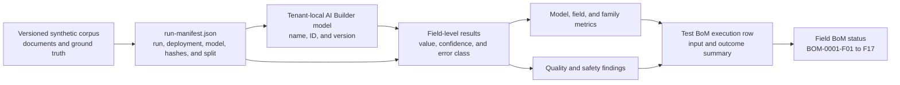

# AI Builder Test Inputs and Outcomes BoM

| Field | Value |
|---|---|
| **Version** | 0.5 |
| **Date** | 2026-10-01 |
| **Author** | docs-agent (Voice of Knowledge) |
| **Status** | Draft |
| **Scope** | UC-0001 AI Builder test-run input and outcome traceability |
| **References** | [Tenant 2 AI Builder Model Implementation Design](../../../../docs/superpowers/specs/2026-09-25-tenant-2-ai-builder-models-design.md), [PeopleDoc Master Data AI Builder Field BoM](bom-0001-peopledoc-master-data-ai-builder-fields.md), [UC-0001 PRD](prd-0001-personal-master-data-completion-agent.md) |

## 1. Purpose and Authority

This repository-owned Build of Materials (BoM) summarizes the inputs and outcomes of every AI Builder model evaluation. It is the authoritative run-level index for planned and completed tests across tenants and environments.

The [PeopleDoc Master Data AI Builder Field BoM](bom-0001-peopledoc-master-data-ai-builder-fields.md) remains authoritative for the 17-field contract lifecycle. The run manifest and machine-readable result files remain authoritative for deployment context, document identity, field-level expected and actual values, confidence, and error classification. This BoM summarizes and links that evidence; it does not duplicate or replace it.

`PersonalMasterDataFixed` version `1.0` completed strict held-out evaluation, passed calculated solution eligibility, received attended approval, and was added as the only component in the unmanaged Tenant 2 DEV `caldovahrfrontier` solution. Explicit pre-mutation approval is recorded before any evaluation publication or flow creation. Exactly four approved held-outs were processed once, producing 4 document results and 68 field records. The evaluation and its metrics are this package's calculated assessment, not a GF statement or approval. Historical blockers remain preserved, the evaluation flow is Off, the separate unpublished draft remains untouched, no automated-write approval was granted, and `PersonalMasterDataGeneral` remains uncreated pending separate Task 11 approval. A blank metric is not treated as zero, and an absent result is not treated as a pass.

## 2. Traceability Model

Every outcome must resolve back to immutable input evidence and forward to the applicable field lifecycle status.


```mermaid
flowchart LR
    Corpus["Versioned synthetic corpus<br/>documents and ground truth"]
    Manifest["run-manifest.json<br/>run, deployment, model, hashes, and split"]
    Model["Tenant-local AI Builder model<br/>name, ID, and version"]
    Results["Field-level results<br/>value, confidence, and error class"]
    Metrics["Model, field, and family metrics"]
    Findings["Quality and safety findings"]
    TestBoM["Test BoM execution row<br/>input and outcome summary"]
    FieldBoM["Field BoM status<br/>BOM-0001-F01 to F17"]

    Corpus --> Manifest
    Manifest --> Model
    Model --> Results
    Manifest --> Results
    Results --> Metrics
    Results --> Findings
    Metrics --> TestBoM
    Findings --> TestBoM
    TestBoM --> FieldBoM
```

## 3. Record Grain and Identifiers

One execution row represents one model version evaluated within one evidence run. The fixed and general models may share a `run_id`, but they retain separate execution rows, results, metrics, findings, and statuses.

| Identifier | Purpose |
|---|---|
| Test BoM ID | Stable row identifier allocated once and never reused |
| `run_id` | Resolves to deployment and input context in `run-manifest.json` |
| `model_name` and `model_version` | Identify the executable evaluated in that run |
| Document hash | Identifies each exact training or held-out input |
| Field BoM ID | Maps every `field_name` result to `BOM-0001-F01` through `BOM-0001-F17` |

The composite evidence identity is `run_id` + `model_name` + `model_version`. Tenant and environment values remain in the run manifest rather than being hard-coded into this portable BoM.

## 4. Controlled Statuses

### 4.1 Input status

| Status | Meaning |
|---|---|
| `Planned` | Allocation is designed, but document hashes and corpus qualification are not complete |
| `Qualified` | Corpus integrity, ground truth, field coverage, hashes, and split integrity pass |
| `Executed` | The qualified inputs were processed by the identified model version |
| `Blocked` | A readiness, corpus, contract, or input-integrity failure prevents execution |

### 4.2 Outcome status

| Status | Meaning |
|---|---|
| `Not run - no evidence` | No complete model result exists |
| `Evaluated - no findings` | Complete metrics exist, the false-value rate is zero, and no present-field extraction finding exists |
| `Evaluated - quality findings` | Complete metrics exist, the false-value rate is zero, and one or more present-field extraction findings exist |
| `Blocked - strict gate failure` | Corpus, contract, attribution, or zero-false-value safety gate failed |
| `Technically complete` | The evaluated model is published, added to the solution, and has complete evidence |
| `Evidence incomplete` | An outcome is claimed but cannot be resolved to the required evidence |

An outcome status never grants approval for a future automated write path.

## 5. Planned Input Inventory

Both models use the same contract fields, `BOM-0001-F01` through `BOM-0001-F17`, but have independent document allocations.

### 5.1 Model-level allocation

| Test BoM ID | Model | Input groups | Training allocation | Initial held-out allocation | Planned documents | Ground truth | Current input status |
|---|---|---|---|---|---:|---|---|
| `BOM-0002-R01` | `PersonalMasterDataFixed` | Four layout collections | Documents 01-05 in each collection | Document 06 in each collection | 24 | Package CSV and JSON | `Qualified` |
| `BOM-0002-R02` | `PersonalMasterDataGeneral` | Eight document families | First two documents in each family | Third document in each family | 24 | Package CSV and JSON | `Qualified` |

The corpus passed qualification, the readiness gate passed, and the run manifest records the document hashes, revisions, and final split. Both input records are `Qualified`.

### 5.2 Fixed-template collections

| Collection | Planned training documents | Planned held-out documents | Planned field results |
|---|---:|---:|---:|
| `Personalblatt` | 5 | 1 | 17 |
| `AnmeldungGemeinde` | 5 | 1 | 17 |
| `Sozialversicherung` | 5 | 1 | 17 |
| `Bankverbindung` | 5 | 1 | 17 |
| **Total** | **20** | **4** | **68** |

### 5.3 General-document families

| Family | Planned training documents | Planned held-out documents | Planned field results |
|---|---:|---:|---:|
| `arbeitsvertrag` | 2 | 1 | 17 |
| `anschreiben` | 2 | 1 | 17 |
| `bewilligung` | 2 | 1 | 17 |
| `versicherung` | 2 | 1 | 17 |
| `zivilstand` | 2 | 1 | 17 |
| `selbstdeklaration` | 2 | 1 | 17 |
| `scan-degraded` | 2 | 1 | 17 |
| `new-joiner-sheet` | 2 | 1 | 17 |
| **Total** | **16** | **8** | **136** |

Planned field-result counts are the held-out document count multiplied by the 17-field contract. They are not test outcomes.

## 6. Test Execution Register

| Test BoM ID | `run_id` | Model version | Deployment context | Solution version | Corpus and generator revisions | Input status | Outcome status | Evidence |
|---|---|---|---|---|---|---|---|---|
| `BOM-0002-R01` | `t2-dev-20260925-001` | `1.0` | [Run manifest](../../../../hr/evidence/ai-builder/tenant-2/DEV/t2-dev-20260925-001/run-manifest.json) | `0.0.0.1` | Corpus `c0310c527f010cc9a24d7a78dae7db1e5ad136116b14306413162fb4223926db`; generator `a0829d218dbce15157e35ca7a4da36c0b8241084597818836871441314f175bd` | `Executed` | `Technically complete` | [Validation results](../../../../hr/evidence/ai-builder/tenant-2/DEV/t2-dev-20260925-001/validation-results.json); [evaluation metrics](../../../../hr/evidence/ai-builder/tenant-2/DEV/t2-dev-20260925-001/evaluation-metrics.json); [evaluation summary](../../../../hr/evidence/ai-builder/tenant-2/DEV/t2-dev-20260925-001/evaluation-summary.md); [prediction capture](../../../../hr/evidence/ai-builder/tenant-2/DEV/t2-dev-20260925-001/prediction-capture-fixed.json); [evaluated ledger](../../../../hr/evidence/ai-builder/tenant-2/DEV/t2-dev-20260925-001/holdout-consumption.json); [approval eligibility](../../../../hr/evidence/ai-builder/tenant-2/DEV/t2-dev-20260925-001/fixed-approval-eligibility.json); [retained-only eligibility reverification](../../../../hr/evidence/ai-builder/tenant-2/DEV/t2-dev-20260925-001/fixed-approval-eligibility-reverification.json); [attended approval](../../../../hr/evidence/ai-builder/tenant-2/DEV/t2-dev-20260925-001/fixed-solution-approval.json); [solution addition](../../../../hr/evidence/ai-builder/tenant-2/DEV/t2-dev-20260925-001/fixed-solution-addition.json) |
| `BOM-0002-R02` | `t2-dev-20260925-001` | Not created | [Run manifest](../../../../hr/evidence/ai-builder/tenant-2/DEV/t2-dev-20260925-001/run-manifest.json) | `0.0.0.1` | Corpus `c0310c527f010cc9a24d7a78dae7db1e5ad136116b14306413162fb4223926db`; generator `a0829d218dbce15157e35ca7a4da36c0b8241084597818836871441314f175bd` | `Qualified` | `Not run - no evidence` | [Readiness](../../../../hr/evidence/ai-builder/tenant-2/DEV/t2-dev-20260925-001/readiness.json); [corpus quality](../../../../hr/evidence/ai-builder/tenant-2/DEV/t2-dev-20260925-001/corpus-quality.json) |

The readiness and capture-capability gates passed before holdout exposure. `PersonalMasterDataFixed` version `1.0` then processed exactly the four approved fixed holdouts once each. The fourth holdout's first portal attempt was rejected before run creation because disablement raced trigger submission; no run or artifact was created. The same approved execution run ID was retried only after explicit start confirmation, succeeded, and the flow was disabled. Strict disposition then calculated an `evaluated` lifecycle transition bound atomically to the retained evidence. Task 10 separately calculated solution eligibility, recorded attended approval, confirmed the evaluated model remained published while a separate draft remained unpublished, and added only the fixed AI model to `caldovahrfrontier`. Export readback confirmed one type-401 root component, no missing dependencies, and none of the excluded evaluation-only components. The flow is Off, no automated-write approval was granted, and `PersonalMasterDataGeneral` remains uncreated pending separate Task 11 approval.

## 7. Outcome Summary

| Test BoM ID | Model | Held-out documents evaluated | Field results recorded | Exact-match accuracy | Precision | Recall | Missing-field precision | False-value rate | Confidence distribution | Findings | Outcome status |
|---|---|---:|---:|---|---|---|---|---|---|---|---|
| `BOM-0002-R01` | `PersonalMasterDataFixed` | 4 of 4 | 68 of 68 | `0.9117647058823529` | `0.9333333333333333` | `0.875` | `1.0` | `0` (count `0`) | See calculated evaluation metrics | Six quality findings: four `dob` findings (`missing` or `invalid_format`) and two `last_name` findings (`incorrect`). All other fields were evaluated with no findings. | `Technically complete` |
| `BOM-0002-R02` | `PersonalMasterDataGeneral` | 0 of 8 | 0 of 136 | Not available - not run | Not available - not run | Not available - not run | Not available - not run | Not available - not run | Not available - not run | No result evidence exists | `Not run - no evidence` |

The required metrics are:

| Metric | Evidence requirement |
|---|---|
| Exact-match accuracy | Report by model, field, and collection or family |
| Precision | Report by model, field, and collection or family |
| Recall | Report by model, field, and collection or family |
| Missing-field precision | Report by model, field, and collection or family |
| False-value rate | Must be zero for expected-absent fields |
| Confidence distribution | Group by exact match, missing, incorrect, and false value |

### 7.1 Integrity and exactly-once evidence

| Artifact | SHA-256 |
|---|---|
| Prediction capture | `21b4c03ffbb478c5f0480c8802a8e920954b35fd62e81b445bc99240cf232054` |
| Evaluation metrics | `b39e0d4384fd2a7e918b9b5156a6774a27d1a809ea655202ea2178127ec1cad2` |
| Evaluated holdout ledger | `2e6c2a7868fe2895e9ba62ebf2ebd532b0ba7298c88a27d0ef24b5062614bc23` |

The four retained capture-pair SHA-256 values are:

1. Holdout 1: `a25bd6371d539ae474e0bdf0a92367301e2113a7f2eb8d6f703b5b0e24998645`
2. Holdout 2: `7be0f59312ba53464062c671a02ca7da1ab79c859f4b0101a996b2ea8fe82efb`
3. Holdout 3: `f1306f371d324c89c2b2a6f26fb2c7a3c15684707ac3a09c038aaff121432f09`
4. Holdout 4: `94f2ef6219e3c80fb6e67d073f9ea0fa4a48faef26b0b1392d618798c0ec4a4d`

## 8. Required Evidence

A completed execution row links to:

```text
hr/evidence/ai-builder/
└── <tenant-key>/
    └── <environment-stage>/
        └── <run-id>/
            ├── readiness.json
            ├── evaluation-capture-intent.json
            ├── evaluation-capture-readiness.json
            ├── corpus-quality.json
            ├── model-inventory.json
            ├── run-manifest.json
            ├── capture-capability.json
            ├── model-evaluation-publication.json
            ├── model-evaluation-published-fixed.png
            ├── validation-results-fixed.csv
            ├── validation-results-general.csv
            ├── validation-results.json
            ├── evaluation-metrics.json
            └── evaluation-summary.md
```

Screenshots may supplement this evidence but cannot replace field-level machine-readable results.

## 9. Maintenance Rules

1. Test BoM IDs are allocated once and never reused.
2. A row advances from `Planned` only from evidence for its exact model version and `run_id`.
3. A deployment to another tenant or environment creates new run evidence and does not overwrite an existing row.
4. If a held-out result influences model tuning, that holdout is consumed and cannot remain the final acceptance set.
5. Every field result maps to exactly one field BoM ID.
6. A present-field mismatch remains a quality finding.
7. A value returned for an expected-absent field is a strict safety failure.
8. Missing, partial, or manually transcribed results are recorded as incomplete evidence, not as passing outcomes.
9. The summary is updated from the machine-readable evidence; it is not an independent source of calculated metrics.
